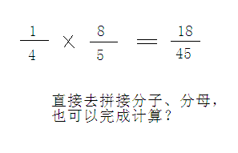
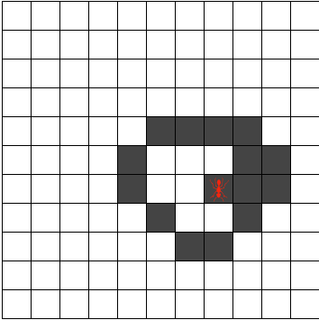

# 第一题

标题：猜年龄

小明带两个妹妹参加元宵灯会。别人问她们多大了，她们调皮地说：“我们俩的年龄之积是年龄之和的6倍”。小明

又补充说：“她们可不是双胞胎，年龄差肯定也不超过8岁啊。”

请你写出：小明的较小的妹妹的年龄。

注意： 只写一个人的年龄数字，请通过浏览器提交答案。不要书写任何多余的内容。

**解析：**

```
for (int i = 1; i <= 100; i++)  //循环小妹妹的年龄
{
	for (int j = i+1; j <= i+8; j++) //循环大妹妹的年龄 
	{
		if(i*j == 6*(i+j))
			System.out.println(i);
	}
}
```

# 第二题

标题：等额本金

小明从银行贷款3万元。约定分24个月，以等额本金方式还款。

这种还款方式就是把贷款额度等分到24个月。每个月除了要还固定的本金外，还要还贷款余额在一个月中产生的

利息。

假设月利率是：0.005，即：千分之五。那么，

第一个月，小明要还本金 1250, 还要还利息：30000 * 0.005，总计 1400。

第二个月，本金仍然要还 1250, 但利息为：(30000-1250) * 0.005 总计 1393.75。

请问：小明在第15个月，应该还款多少（本金和利息的总和）？

请把答案金额四舍五入后，保留两位小数。注意：32.5，一定要写为：32.50

通过浏览器提交答案，这是一个含有小数点和两位小数的浮点数字。不要写多余内容（例如：多写了“元”或添加说

明文字）

**解析：**

```
public static void main(String[] args) 
{
	double sum = 30000;  //记录剩余还款本金总金额
	double hk = 0; //记录每月的还款
	for (int i = 1; i <= 15; i++) 
	{
		hk = 1250 + sum*0.005; //计算每个月还款金额
		sum = sum - 1250; //计算剩余还款本金总金额
	}
	System.out.println(format(hk));
}

public static String format(double num)
{
	DecimalFormat df = new DecimalFormat("#.00");
	df.setRoundingMode(RoundingMode.HALF_UP);
	return df.format(num);
}
```


# 第三题

标题：猜字母

把abcd...s共19个字母组成的序列重复拼接106次，得到长度为2014的串。

接下来删除第1个字母（即开头的字母a），以及第3个，第5个等所有奇数位置的字母。

得到的新串再进行删除奇数位置字母的动作。如此下去，最后只剩下一个字母，请写出该字母。

答案是一个小写字母，请通过浏览器提交答案。不要填写任何多余的内容。

**解析：**

```
//准备题目要求的2014个字符组成的字符串
String s = "";
for (int i = 1; i <= 106; i++) 
	s += "abcdefghijklmnopqrs";
//将字符串中所有字符存储list集合中
List<Character> list = new ArrayList<Character>();
for (int i = 0; i < s.length(); i++) {
	list.add(s.charAt(i));
}
//利用死循环不停的执行删除1，3，5，7位置的数据
while(true)
{
	//给需要删除的元素做标记，需要删除的元素值全部变成0
	//此处如果不做标记直接删除，集合的下标在删除过程中是动态变化的与题意不符
	for (int i = 0; i < list.size(); i=i+2) 
		list.set(i, '0');
	//删除元素内容为'0'的元素
	for (int i = 0; i < list.size(); i++) 
	{
		if(list.get(i) == '0')
			list.remove(i);
	}
	//判断只有一个元素的时候得到答案
	if(list.size() == 1)
	{
		System.out.println(list.get(0));
		break;
	}		
}
```


# 第四题

标题：大衍数列

中国古代文献中，曾记载过“大衍数列”, 主要用于解释中国传统文化中的太极衍生原理。

它的前几项是：0、2、4、8、12、18、24、32、40、50 ...

其规律是：对偶数项，是序号平方再除2，奇数项，是序号平方减1再除2。

以下的代码打印出了大衍数列的前 100 项。

```
for(int i=1; i<100; i++)
{
	if(________________)  //填空
		System.out.println(i*i/2);
	else
		System.out.println((i*i-1)/2);
}
```

请填写划线部分缺失的代码。通过浏览器提交答案。

注意：不要填写题面已有的内容，也不要填写任何说明、解释文字。

**解析：**

根据题意，和数据0、2、4、8、12、18、24、32、40、50 的推理，题目所说的序号，是从1开始的序号；

根据System.out.println(i*i/2);代码得知，上面的条件应该是判断该项为偶数项。

```
if(i%2==0)  //填空
```

# 第五题

标题：写日志

写日志是程序的常见任务。现在要求在 t1.log, t2.log, t3.log 三个文件间轮流写入日志。也就是说第一次写入

t1.log，第二次写入t2.log，... 第四次仍然写入t1.log，如此反复。

下面的代码模拟了这种轮流写入不同日志文件的逻辑。

```
public class A
{
	private static int n = 1;
	
	public static void write(String msg)
	{
		String filename = "t" + n + ".log";
		n = ____________;
		System.out.println("write to file: " + filename + " " + msg);
	}
}
```

请填写划线部分缺失的代码。通过浏览器提交答案。

注意：不要填写题面已有的内容，也不要填写任何说明、解释文字。

**解析：**

根据题意，当n=3之后，不允许出现4，重新变成1，编写如下代码测试：

```
private static int n = 1;

public static void write(String msg)
{
	String filename = "t" + n + ".log";
	n = n==3?1:n+1;
	System.out.println("write to file: " + filename + " " + msg);
}

public static void main(String[] args) {
	write("test");
	write("test");
	write("test");
	write("test");
	write("test");
	write("test");
	write("test");
}
```

上述代码，可以打印出

```
write to file: t1.log test
write to file: t2.log test
write to file: t3.log test
write to file: t1.log test
write to file: t2.log test
write to file: t3.log test
write to file: t1.log test
```

符合题意描述的轮流在三个文件中打印

答案为：

```
n = n==3?1:n+1;
```


# 第六题

标题：李白打酒

话说大诗人李白，一生好饮。幸好他从不开车。

一天，他提着酒壶，从家里出来，酒壶中有酒2斗。他边走边唱：

“无事街上走，提壶去打酒。逢店加一倍，遇花喝一斗。”

这一路上，他一共遇到店5次，遇到花10次，已知最后一次遇到的是花，他正好把酒喝光了。

请你计算李白遇到店和花的次序，可以把遇店记为a，遇花记为b。则：babaabbabbabbbb 就是合理的次序。像

这样的答案一共有多少呢？请你计算出所有可能方案的个数（包含题目给出的）。

注意：通过浏览器提交答案。答案是个整数。不要书写任何多余的内容。

**解析：**

可以先简化题目如下：

李白每走一步可能遇到店，也可能遇到花，李白一共走三步，求所有他遇到店和花的所有次序序列。

```
static char[] arr = new char[3];
public static void walk(int d,int h)
{
    if(d + h == 3)
    {
        System.out.println(new String(arr));
        return;
    }
    arr[d+h] = 'd';
    walk(d+1,h);
    arr[d+h] = 'h';
    walk(d,h+1);
}
public static void main(String[] args) {
    int d = 0; //遇到店的次数
    int h = 0; //遇到花的次数
    walk(d,h);
}
```

此题，当李白在街上走的时候，只可能遇到店或遇到酒，所以可以采取两个递归调用，分别调用遇到店和遇到酒的

情况，把所有情况都运行一遍，然后在递归函数中判断是否是最后一次，并且遇到花，并且酒正好剩一斗。

```
public static int count=0; //答案
public static void walk(int wine,int dian,int hua)
{
	//此条件表示5个店都已经经过,10个花经过了9个，并且酒壶中只有1斗酒
	if(dian==5 && hua==9 && wine == 1)
		count++;
	if(dian <= 4)
		walk(wine*2,dian+1,hua);
	if(hua <= 9)
		walk(wine-1,dian,hua+1);
}
public static void main(String[] args) {
	int wine = 2; //初始状态酒2斗
	int dian = 0; //遇到店的次数
	int hua = 0; //遇到花的次数
	walk(wine,dian,hua);
	System.out.println(count);
}
```

答案：14

# 第七题

标题：奇怪的分式

上小学的时候，小明经常自己发明新算法。一次，老师出的题目是：

1/4 乘以 8/5

小明居然把分子拼接在一起，分母拼接在一起，答案是：18/45 （参见图1.png）



老师刚想批评他，转念一想，这个答案凑巧也对啊，真是见鬼！

对于分子、分母都是 1~9 中的一位数的情况，还有哪些算式可以这样计算呢？

请写出所有不同算式的个数（包括题中举例的）。

显然，交换分子分母后，例如：4/1 乘以 5/8 是满足要求的，这算做不同的算式。

但对于分子分母相同的情况，2/2 乘以 3/3 这样的类型太多了，不在计数之列!

注意：答案是个整数（考虑对称性，肯定是偶数）。请通过浏览器提交。不要书写多余的内容。

**解析一：**

```
//求两个数的公约数
public static int gys(int a,int b)
{
	if(b == 0)	return a;
	return gys(b,a%b);
}
public static void main(String[] args) {
	int count=0; //答案
	//a:第一个数分子,b:第一个数分母,c:第二个数分子,d:第三个数分母
	for (int a = 1; a <= 9; a++) 
	{
		for (int b = 1; b <= 9; b++) 
		{
			if(a == b) continue;  //分子和分母不能相同
			for (int c = 1; c <= 9; c++) 
			{
				for (int d = 1; d <= 9; d++) 
				{
					if(c == d) continue; //分子和分母不能相同
					//因为(a/b)*(c/d)=(a*c)/(b*d)，第一个结果为(a*c)/(b*d)
					//小明把分子拼在一起，分母拼接一起的第二个结果为(a*10+c)/(b*10+d)
					//如果(a*c)==(a*10+c)&&(b*d)==(b*10+d),保证两个结果中的分子相同，分母也相同则符合题意
					//但是会出现 1/3和3/9此种情况，他们的分子分母各不相同，但结果其实是相同的符合题意
					//所以我们需要进行将第一个结果和第二个结果进行求公约数约分，然后判断分子分母相同
					int gys1 = gys(a*c,b*d);  //求第一个结果的公约数
					int gys2 = gys(a*10+c,b*10+d); //求第二个结果的公约数
					//两个结果除以公约数后，分子分母是否相同
					if((a*c)/gys1==(a*10+c)/gys2 && (b*d)/gys1 == (b*10+d)/gys2)
						count++;
				}
			}
		}
	}
	System.out.println(count);
}
```

**解析二：**

如果对求公约数的函数感觉很难理解，可以不用求公约数，即第一个数的分子乘以第二个数的分母如果等于第一个数的分母乘以第二个数的分子，则也可以证明两个数字相等。

```
int count=0; //答案
//a:第一个数分子,b:第一个数分母,c:第二个数分子,d:第三个数分母
for (int a = 1; a <= 9; a++) 
{
    for (int b = 1; b <= 9; b++) 
    {
        if(a == b) continue;  //分子和分母不能相同
        for (int c = 1; c <= 9; c++) 
        {
            for (int d = 1; d <= 9; d++) 
            {
                if(c == d) continue; //分子和分母不能相同
                //因为(a/b)*(c/d)=(a*c)/(b*d)，第一个结果为(a*c)/(b*d)
                //小明把分子拼在一起，分母拼接一起的第二个结果为(a*10+c)/(b*10+d)
                //第一个数的分子乘第二个数的分母如果等于第一个数的分母乘第二个数的分子,证明两个数字相等
                if((a*c)*(b*10+d) == (b*d)*(a*10+c))
                	count++;
            }
        }
    }
}
System.out.println(count);
```


# 第八题

标题：兰顿蚂蚁



兰顿蚂蚁，是于1986年，由克里斯·兰顿提出来的，属于细胞自动机的一种。

平面上的正方形格子被填上黑色或白色。在其中一格正方形内有一只“蚂蚁”。

蚂蚁的头部朝向为：上下左右其中一方。

蚂蚁的移动规则十分简单：

若蚂蚁在黑格，右转90度，将该格改为白格，并向前移一格；

若蚂蚁在白格，左转90度，将该格改为黑格，并向前移一格。

规则虽然简单，蚂蚁的行为却十分复杂。刚刚开始时留下的路线都会有接近对称，像是会重复，但不论起始状态如何，蚂蚁经过漫长的混乱活动后，会开辟出一条规则的“高速公路”。

蚂蚁的路线是很难事先预测的。

你的任务是根据初始状态，用计算机模拟兰顿蚂蚁在第n步行走后所处的位置。

【数据格式】

输入数据的第一行是 m n 两个整数（3 < m, n < 100），表示正方形格子的行数和列数。
接下来是 m 行数据。
每行数据为 n 个被空格分开的数字。0 表示白格，1 表示黑格。

接下来是一行数据：x y s k, 其中x y为整数，表示蚂蚁所在行号和列号（行号从上到下增长，列号从左到右增长，都是从0开始编号）。s 是一个大写字母，表示蚂蚁头的朝向，我们约定：上下左右分别用：UDLR表示。k 表示蚂蚁走的步数

输出数据为两个空格分开的整数 p q, 分别表示蚂蚁在k步后，所处格子的行号和列号。

```
例如, 输入：
5 6
0 0 0 0 0 0
0 0 0 0 0 0
0 0 1 0 0 0
0 0 0 0 0 0
0 0 0 0 0 0
2 3 L 5
程序应该输出：
1 3

再例如, 输入：
3 3
0 0 0
1 1 1
1 1 1
1 1 U 6
程序应该输出：
0 0
```

资源约定：
峰值内存消耗（含虚拟机） < 256M
CPU消耗  < 1000ms

请严格按要求输出，不要画蛇添足地打印类似：“请您输入...” 的多余内容。

所有代码放在同一个源文件中，调试通过后，拷贝提交该源码。
注意：不要使用package语句。不要使用jdk1.7及以上版本的特性。
注意：主类的名字必须是：Main，否则按无效代码处理。

**解析：**

```
static int[][] arr; //定义二维数组表示方格矩阵
static int row = 0; //蚂蚁所在的位置的X轴坐标
static int col = 0; //蚂蚁所在的位置的Y轴坐标
static char dir = ' '; //蚂蚁头的朝向（上下左右分别用：UDLR表示）
//grid：蚂蚁所在位置是白格（0）还是黑格（1）
public static void move(int grid)
{
	if(grid == 1)//如果蚂蚁在黑格子,方向右转90度
	{
		if(dir == 'U') dir='R';
		else if(dir == 'D') dir='L';
		else if(dir == 'L') dir='U';
		else if(dir == 'R') dir='D';		
		arr[row][col] = 0; //将当前格子变成白格子
	}
	if(grid == 0)//如果蚂蚁在白格子,方向左转90度
	{
		if(dir == 'U') dir='L';
		else if(dir == 'D') dir='R';
		else if(dir == 'L') dir='D';
		else if(dir == 'R') dir='U';
		arr[row][col] = 1; //将当前格子变成黑格子
	}
	//改变蚂蚁当前位置，进行移动一格
	if(dir=='U') row--;
	if(dir=='D') row++;
	if(dir=='L') col--;
	if(dir=='R') col++;	
}

public static void main(String[] args) {
	Scanner input = new Scanner(System.in);
	int m = input.nextInt(); //方格的行数
	int n = input.nextInt(); //方格每行的列数
	arr = new int[m][n]; //定义二维数组表示方格矩阵
	//循环接收矩阵的输入(0代表白格子,1代表黑格子)
	for (int i = 0; i < arr.length; i++) {
		for (int j = 0; j < arr[i].length; j++) {
			arr[i][j] = input.nextInt();
		}
	}
	row = input.nextInt(); //蚂蚁初始位置的X轴坐标
	col = input.nextInt(); //蚂蚁初始位置的Y轴坐标
	dir = input.next().charAt(0); //蚂蚁头的朝向（上下左右分别用：UDLR表示）
	int step = input.nextInt(); //蚂蚁走的步数
	//循环模拟蚂蚁每步的移动
	for (int i = 1; i <= step; i++) 
	{
		move(arr[row][col]);
	}
	System.out.println(row+" "+col);
}
```


# 第九题

标题：地宫取宝

X 国王有一个地宫宝库。是 n x m 个格子的矩阵。每个格子放一件宝贝。每个宝贝贴着价值标签。

地宫的入口在左上角，出口在右下角。

小明被带到地宫的入口，国王要求他只能向右或向下行走。

走过某个格子时，如果那个格子中的宝贝价值比小明手中任意宝贝价值都大，小明就可以拿起它（当然，也可以不拿）。

当小明走到出口时，如果他手中的宝贝恰好是k件，则这些宝贝就可以送给小明。

请你帮小明算一算，在给定的局面下，他有多少种不同的行动方案能获得这k件宝贝。

【数据格式】

输入一行3个整数，用空格分开：n m k (1<=n,m<=50, 1<=k<=12)

接下来有 n 行数据，每行有 m 个整数 Ci (0<=Ci<=12)代表这个格子上的宝物的价值

要求输出一个整数，表示正好取k个宝贝的行动方案数。该数字可能很大，输出它对 1000000007 取模的结果。

```
例如，输入：
2 2 2
1 2
2 1
程序应该输出：
2

再例如，输入：
2 3 2
1 2 3
2 1 5
程序应该输出：
14
```

资源约定：
峰值内存消耗（含虚拟机） < 256M
CPU消耗  < 2000ms

请严格按要求输出，不要画蛇添足地打印类似：“请您输入...” 的多余内容。

所有代码放在同一个源文件中，调试通过后，拷贝提交该源码。
注意：不要使用package语句。不要使用jdk1.7及以上版本的特性。
注意：主类的名字必须是：Main，否则按无效代码处理。

**解析：**

**方案一：**

```
static int n;  //矩阵n行
static int m; //矩阵m列
static int k; //要求取宝贝的数量
static int[][] arr; //定义矩阵的二维数组
static long result=0; //答案	

//rowIndex:当前X轴坐标;colIndex:当前Y轴坐标;
//max:行走过程中最大价值;count:手中宝贝数量
public static void move(int rowIndex,int colIndex,int max,int count)
{
	if(rowIndex >= n || colIndex >= m || count > k) //当走出矩阵或者宝贝数量过多则退出函数
		return;
	if(rowIndex == n-1 && colIndex == m-1) //走到最后一格格子
	{
		//当宝贝数量已经符合题意，则最后一次不拿宝贝
		//当宝贝差一个并且最后一格格子价值高于最大值，则拿起最后一格宝贝符合题意
		if(count == k || (count == k-1 && arr[rowIndex][colIndex] > max)) 
		{
			result++;
			result = result % 1000000007;
		}
	}
	if(arr[rowIndex][colIndex] > max) //当前格子价格大于任意宝贝价格
	{
			move(rowIndex+1,colIndex,arr[rowIndex][colIndex],count+1); //右走,拿起宝贝
			move(rowIndex+1,colIndex,max,count);//右走,不拿宝贝
			move(rowIndex,colIndex+1,arr[rowIndex][colIndex],count+1); //下走,拿起宝贝	
			move(rowIndex,colIndex+1,max,count);	 //下走，不拿宝贝
	}
	else
	{
		move(rowIndex+1,colIndex,max,count);//右走,不拿宝贝
		move(rowIndex,colIndex+1,max,count);	 //下走，不拿宝贝
	}	
}

public static void main(String[] args) 
{
	Scanner input  = new Scanner(System.in);
	n = input.nextInt();  //矩阵n行
	m = input.nextInt(); //矩阵m列
	arr = new int[n][m]; //定义矩阵的二维数组
	k = input.nextInt(); //取K件宝贝
	//循环输入矩阵中每件宝贝的价值
	for (int i = 0; i < n; i++) 
	{
		for (int j = 0; j < m; j++) 
		{
			arr[i][j] = input.nextInt();
		}
	}
	move(0,0,-1,0); //max值给-1因为宝物价值可以为0
	System.out.println(result );
}
```

方案一有很多重复递归计算，效率较低，例如，如下数组：

```
1	2	3
4	5	6
7	8	9
```

如果数据定位在5的位置，并且递归函数的四个参数完全相同的情况下，也就是坐标相同，最大值相同，宝贝数量也相同，只需要向里层递归一次求得结果即可，不需要每次重复递归计算。

**方案二：**

（1）定义四维数组，存储递归函数四个参数取不同值的时候到右下角的方案数量，即答案，判断是否经历过计

算，避免重复计算，提高运行效率。

（2）1到9的数量=2到9数量+4到9的数量；2到9数量=3到9的数量+5到9的数量；......,所以在每次递归调用的时候

进行累加计算。

```
static int n;  //矩阵n行
static int m; //矩阵m列
static int k; //要求取宝贝的数量
static int[][] arr; //定义矩阵的二维数组
static long data[][][][] = new long[55][55][15][15];
//rowIndex:当前X轴坐标;colIndex:当前Y轴坐标;
//max:行走过程中最大价值;count:手中宝贝数量
public static long move(int rowIndex,int colIndex,int max,int count)
{
	if(data[rowIndex][colIndex][max+1][count] != -1) 
		return data[rowIndex][colIndex][max+1][count];
	long result=0; //答案	
	if(rowIndex >= n || colIndex >= m || count > k) //当走出矩阵或者宝贝数量过多则退出函数
		return 0;
	if(rowIndex == n-1 && colIndex == m-1) //走到最后一格格子
	{
		//当宝贝数量已经符合题意，则最后一次不拿宝贝
		//当宝贝差一个并且最后一格格子价值高于最大值，则拿起最后一格宝贝符合题意
		if(count == k || (count == k-1 && arr[rowIndex][colIndex] > max)) 
			return 1;
		return 0;
	}
	if(arr[rowIndex][colIndex] > max) //当前格子价格大于任意宝贝价格
	{
			result += move(rowIndex+1,colIndex,arr[rowIndex][colIndex],count+1); //右走,拿起宝贝
			result += move(rowIndex+1,colIndex,max,count);//右走,不拿宝贝
			result += move(rowIndex,colIndex+1,arr[rowIndex][colIndex],count+1); //下走,拿起宝贝	
			result += move(rowIndex,colIndex+1,max,count);	 //下走，不拿宝贝
	}
	else
	{
		result += move(rowIndex+1,colIndex,max,count);//右走,不拿宝贝
		result += move(rowIndex,colIndex+1,max,count);	 //下走，不拿宝贝
	}	
	//System.out.println(rowIndex+","+colIndex+","+max+","+count+"="+result);
	data[rowIndex][colIndex][max+1][count] = result%1000000007;
	return result;
}
//初始化data数据全部为-1
public static void InitData()
{
	for (int a = 0; a < 55; a++) {
		for (int b = 0; b < 55; b++) {
			for (int c = 0; c < 15; c++) {
				for (int d = 0; d < 15; d++) {
					data[a][b][c][d] = -1;
				}
			}
		}
	}
}

public static void main(String[] args) 
{
	Scanner input  = new Scanner(System.in);
	n = input.nextInt();  //矩阵n行
	m = input.nextInt(); //矩阵m列
	arr = new int[n][m]; //定义矩阵的二维数组
	k = input.nextInt(); //取K件宝贝
	//循环输入矩阵中每件宝贝的价值
	for (int i = 0; i < n; i++) 
	{
		for (int j = 0; j < m; j++) 
		{
			arr[i][j] = input.nextInt();
		}
	}
	InitData();
	long r = move(0,0,-1,0); //max值给-1因为宝物价值可以为0
	System.out.println(r );
}
```


# 第十题

标题：矩阵翻硬币

小明先把硬币摆成了一个 n 行 m 列的矩阵。

随后，小明对每一个硬币分别进行一次 Q 操作。

对第x行第y列的硬币进行 Q 操作的定义：将所有第 i*x 行，第 j*y 列的硬币进行翻转。

其中i和j为任意使操作可行的正整数，行号和列号都是从1开始。

当小明对所有硬币都进行了一次 Q 操作后，他发现了一个奇迹——所有硬币均为正面朝上。

小明想知道最开始有多少枚硬币是反面朝上的。于是，他向他的好朋友小M寻求帮助。

聪明的小M告诉小明，只需要对所有硬币再进行一次Q操作，即可恢复到最开始的状态。然而小明很懒，不愿意照做。于是小明希望你给出他更好的方法。帮他计算出答案。

【数据格式】

输入数据包含一行，两个正整数 n m，含义见题目描述。

输出一个正整数，表示最开始有多少枚硬币是反面朝上的。

```
【样例输入】
2 3

【样例输出】
1
```

【数据规模】
对于10%的数据，n、m <= 10^3；
对于20%的数据，n、m <= 10^7；
对于40%的数据，n、m <= 10^15；
对于100%的数据，n、m <= 10^1000（10的1000次方）。

资源约定：
峰值内存消耗（含虚拟机） < 256M
CPU消耗  < 2000ms

请严格按要求输出，不要画蛇添足地打印类似：“请您输入...” 的多余内容。

所有代码放在同一个源文件中，调试通过后，拷贝提交该源码。
注意：不要使用package语句。不要使用jdk1.7及以上版本的特性。
注意：主类的名字必须是：Main，否则按无效代码处理。

**解析：**

**方案一：**

题目中提示：“聪明的小M告诉小明，只需要对所有硬币再进行一次Q操作，即可恢复到最开始的状态。”

即假设所有格子硬币都是正面的，反向进行上述分析的模拟。

```
Scanner input = new Scanner(System.in);
int n = input.nextInt(); //硬币矩阵n行
int m = input.nextInt(); //硬币矩阵m列
int[][] arr = new int[n+1][m+1];  //定义硬币(数组大小+1的原因和题意相符，下标从1开始)
//将所有硬币变成正面（1：正面；0：反面）
for (int x = 1; x <= n; x++) {
	for (int y = 1; y <= m; y++) {
		arr[x][y] = 1;
	}
}
//模拟Q操作
for (int x = 1; x <= n; x++) {
	for (int y = 1; y <= m; y++) {
		//循环行号和列好的倍数
		for (int i = 1; i*x <= n; i++) {
			for (int j = 1; j*y<=m; j++) {
				int temp = arr[i*x][j*y];
				arr[i*x][j*y] = temp==1?0:1;
			}
		}
	}
}
int count = 0; //假设反面的数量为0
for (int x = 1; x <= n; x++) {
	for (int y = 1; y <= m; y++) {
		if(arr[x][y] == 0)
			count++;
	}
}	
System.out.println(count);
```

由于题目有专门的描述如下：

```
【数据规模】
对于10%的数据，n、m <= 10^3；
对于20%的数据，n、m <= 10^7；
对于40%的数据，n、m <= 10^15；
对于100%的数据，n、m <= 10^1000（10的1000次方）。
资源约定：
峰值内存消耗（含虚拟机） < 256M
CPU消耗  < 2000ms
```

则表示此题对执行效率有一定的要求，而进行方案一进行模拟的形式，如果数据量大的情况下，效率低，不能完全满足题目的要求。

**方案二：**

假设硬币矩阵如下，模拟所有硬币Q操作翻转过程如下：

```
1	2	3
4	5	6
7	8	9
```

对第一个硬币Q操作，需要翻转硬币：1，2，3，4，5，6，7，8，9（即全部）

对第二个硬币Q操作，需要翻转硬币：2，5，8

对第三个硬币Q操作，需要翻转硬币：3，6，9

对第四个硬币Q操作，需要翻转硬币：4，5，6

对第五个硬币Q操作，需要翻转硬币：5

对第六个硬币Q操作，需要翻转硬币：6

对第七个硬币Q操作，需要翻转硬币：7，8，9

对第八个硬币Q操作，需要翻转硬币：8

对第九个硬币Q操作，需要翻转硬币：9

思路：

（1）每个硬币，如果知道被翻转了几次，则可以求出该硬币初始状态是正面还是反面，翻转了奇数次硬币初始为反面，翻转了偶数次硬币为正面。

（2）通过上述数据得出规律，翻转次数=行号的约数个数*列号的约数个数，即：

第一个硬币，行号为1（约数1，只有1个），列号为1（约数1，只有1个），翻转数量=1*1=1

第二个硬币，行号为1（约数1，只有1个），列号为2（约数1，2，有2个），翻转数量=1*2=2

第三个硬币，行号为1（约数1，只有1个），列号为3（约数1，3，有2个），翻转数量=1*2=2

第四个硬币，行号为2（约数1，2，有2个），列号为1（约数1，有1个），翻转数量=2*1=2

第五个硬币，行号为2（约数1，2，有2个），列号为2（约数1，2，有2个），翻转数量=2*2=4

第六个硬币，行号为2（约数1，2，有2个），列号为3（约数1，3，有2个），翻转数量=2*2=4

第七个硬币，行号为3（约数1，3，有2个），列号为1（约数1，有1个），翻转数量=2*1=2

第八个硬币，行号为3（约数1，3，有2个），列号为2（约数1，2，有2个），翻转数量=2*2=4

第九个硬币，行号为3（约数1，3，有2个），列号为3（约数1，3，有2个），翻转数量=2*2=4

（3）实际上不需要求行号和列号的约数个数，只需要确定约数个数是奇数还是偶数即可，如何确定某个数字的约数个数是奇数还是偶数，有规律：平方数的约数个数是奇数，其它数字的约数个数为偶数，例如：

4约数（1，2，4）有三个为奇数；9的约数（1，3，9）有三个为奇数；16约数（1，2，4，8，16）有5个为奇数

5约束（1，5）有两个为偶数；10约束（1，2，5，10）有四个为偶数；15约数（1，3，5，15）有四个为偶数

（4）翻转次数=行号的约数个数*列号的约数个数；并且（奇乘奇=奇，奇乘偶=偶，偶乘偶=偶），当结果为奇数时，初始状态才是反面，则要求行号约数个数和列号的约数个数都为奇数，则要求行号和列号都为平方数。

（5）即题目含义变成了求行号范围内有几个平方数，列号范围内有几个平方数，结果为两个数字的乘积。

（6）如果循环遍历行号和列号求含有平方数的个数，效率仍然很低下，有规律：某个数字内平方数的个数等于该数字的开方取整，例如：

9里面（1，4，9）三个平方数，9的开方也等于三；

20里面（1，4，9，16）四个平方数，20的开方然后取整等于四。

（7）我们得到结论：初始为反面的个数=行号的开方 乘 列号的开方。

（8）由于行号和列号范围可以为（10的1000次方），直接用数字类型无法表示，无法使用Math.sqrt进行开方，只能将数字做为字符串进行处理。

（9）当数字字符串的长度为偶数，则开方结果的长度为（本身长度/2）；当数字字符串的长度为奇数，则开方结果的长度为（本身长度/2+1）,例如：

99长度为2，开方取整为9，长度为1；100长度为3，开方结果为10，长度为2；

（10）确定了开方长度之后，利用BigInteger和char[]数组，确定数组每一位数字求出开方结果。

```
public static void main(String[] args) {
	Scanner input = new Scanner(System.in);
	String n = input.next(); //硬币矩阵n行
	String m = input.next(); //硬币矩阵m列
	BigInteger rowSqrt = sqrt(n);
	BigInteger colSqrt = sqrt(m);
	System.out.println(rowSqrt.multiply(colSqrt));	
}
public static BigInteger sqrt(String s)
{
	//数字字符串的长度为偶数，则开方结果的长度为（本身长度/2）；
	//当数字字符串的长度为奇数，则开方结果的长度为（本身长度/2+1）
	int len = s.length() % 2 == 0 ? s.length()/2 : s.length()/2+1; //求开方之后的字符串长度
	char[] arr = new char[len]; //定义字符数组用于存放开方后的字符串
	Arrays.fill(arr,'0'); //将字符数组所有元素设置为'0'
	BigInteger num = new BigInteger(s); //将字符串转成BigInteger类型
	for (int i = 0; i < arr.length; i++) 
	{
		//循环确定字符数组每一位的数字
		for (char c = '0'; c <= '9'; c++) 
		{
			arr[i] = c;
			BigInteger sqrtNum = new BigInteger(String.valueOf(arr));
			if(sqrtNum.pow(2).compareTo(num) == 1) //当前假设数字的平方超过了数字本身，则减1操作
			{
				arr[i] -= 1;
				break;
			}
		}
	}
	return new BigInteger(String.valueOf(arr));
}
```

