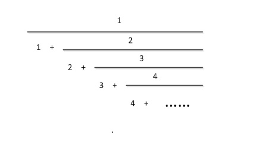
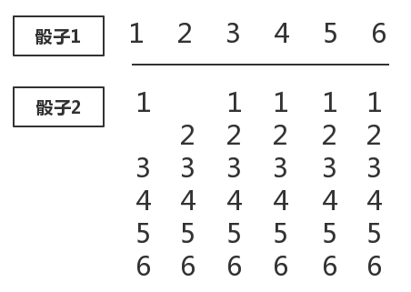

# 第一题

标题：隔行变色

Excel表的格子很多，为了避免把某行的数据和相邻行混淆，可以采用隔行变色的样式。

小明设计的样式为：第1行蓝色，第2行白色，第3行蓝色，第4行白色，....

现在小明想知道，从第21行到第50行一共包含了多少个蓝色的行。

请你直接提交这个整数，千万不要填写任何多余的内容。

```
int blue = 0;
for (int i = 21; i <= 50; i++)
{
    if(i%2 == 1)
    	blue++;
}
System.out.println(blue);
```

```
答案：15
```

# 第二题

标题：立方尾不变

有些数字的立方的末尾正好是该数字本身。比如：1,4,5,6,9,24,25,....

请你计算一下，在10000以内的数字中（指该数字，并非它立方后的数值），符合这个特征的正整数一共有多少个。

请提交该整数，不要填写任何多余的内容。

**解析：**该试题的数据会出现10000的立方，10000的立方在64位机器上可以表示，但是在32位机器上会超出long类型的数据范围，需要借助BigInteger来实现程序功能。

**方案一：**

在64位机器上代码如下：

```
int count = 0; //答案
for (long i = 1; i < 10000; i++) 
{
    long powNum = i*i*i;
    String strNum = i+"";
    String strPowNum = powNum+"";
    String strLast = strPowNum.substring(strPowNum.length()-strNum.length());
    if(strNum.equals(strLast))
    	count++;
}
System.out.println(count);
```

**方案二：**

在32位机器上代码如下：

```
BigInteger start = new BigInteger("1");
BigInteger end = new BigInteger("10000");
BigInteger step = new BigInteger("1");
//compareTo:小于返回-1；等于返回0；大于返回1
int count = 0; //答案
for (BigInteger num = start; num.compareTo(end) == -1; num=num.add(step)) 
{
	BigInteger powNum = num.pow(3);
	String strNum = num.toString();
	String strPowNum = powNum.toString();
	String strLast = strPowNum.substring(strPowNum.length()-strNum.length());
	if(strNum.equals(strLast))
		count++;
}
System.out.println(count);
```

```
答案：36
```

# 第三题

标题：无穷分数

无穷的分数，有时会趋向于固定的数字。

请计算【图1.jpg】所示的无穷分数，要求四舍五入，精确到小数点后5位，小数位不足的补0。



请填写该浮点数，不能填写任何多余的内容。

**方案一：**

由题意得知：当n足够大的时候，f(n)的值与1无限接近，我们可以取一个大的数字倒序循环计算。

```
double temp = 1; 
double r = 0; //结果
for (double i = 100; i >= 1; i--) 
{
	r = i / (i + temp);
	temp = r;
}
System.out.println(r);
```

```
结果：0.5819767068693263
```

当修改i初始值值为200，300后发现，结果的前5为并没有受到影响，则

```
答案：0.58198
```

**方案二：**

由题意得知：f(n) = n / (n+f(n+1))，也可以采取递归的方式进行计算。

```
public static double dfs(int n)
{
    if(n == 200)
    	return 1;
    return n/(n+dfs(n+1));
}
public static void main(String[] args) {
	System.out.println(dfs(1));	
}
```

```
结果：0.5819767068693263
```

当修改n的值为200，300后发现，结果的前5为并没有受到影响，则

```
答案：0.58198
```

# 第四题

标题：循环节长度

两个整数做除法，有时会产生循环小数，其循环部分称为：循环节。

比如，11/13=6=>0.846153846153.....  其循环节为[846153] 共有6位。

下面的方法，可以求出循环节的长度。

请仔细阅读代码，并填写划线部分缺少的代码。

```
public static int f(int n, int m)
{
    n = n % m;	
    Vector v = new Vector();

    for(;;)
    {
        v.add(n);
        n *= 10;
        n = n % m;
        if(n==0) return 0;
        if(v.indexOf(n)>=0)  _________________________________ ;  //填空
    }
}
```

注意，只能填写缺少的部分，不要重复抄写已有代码。不要填写任何多余的文字。

**解析：**

将题目代码做修改如下，观察Vector列表中的数据：

```
public static void f(int n, int m)
{
    n = n % m;	
    Vector v = new Vector();
    for(int i=1;i<=20;i++)
    {
        v.add(n);
        n *= 10;
        n = n % m;
        //if(n==0) return 0;
        //if(v.indexOf(n)>=0)  _________________________________ ;  //填空
    }
    System.out.println(v);
}
public static void main(String[] args) 
{
	System.out.println(11.0/13);
	f(11,13);
	System.out.println(7.0/18);
	f(7,18);
}
```

程序运行结果为：

```
0.8461538461538461
[11, 6, 8, 2, 7, 5, 11, 6, 8, 2, 7, 5, 11, 6, 8, 2, 7, 5, 11, 6]
0.3888888888888889
[7, 16, 16, 16, 16, 16, 16, 16, 16, 16, 16, 16, 16, 16, 16, 16, 16, 16, 16, 16]
```

由上述结果我们可以看出除法结果的循环节长度和乘10求余数结果的循环节长度是相同的，即：

```
846153长度为6，[11, 6, 8, 2, 7, 5]长度为6
8的长度为1，[16]长度为1
```

题目中 if(n==0) 代表可以除尽，返回0，那么下面的if则需要返回题目要求的循环节长度，答案为：

```
return v.size() - v.indexOf(n);
```


# 第五题

标题：格子中输出

stringInGrid方法会在一个指定大小的格子中打印指定的字符串。

要求字符串在水平、垂直两个方向上都居中。

如果字符串太长，就截断。

如果不能恰好居中，可以稍稍偏左或者偏上一点。

下面的程序实现这个逻辑，请填写划线部分缺少的代码。

```
public static void stringInGrid(int width, int height, String s)
{
	if(s.length()>width-2) s = s.substring(0,width-2);
	System.out.print("+");
	for(int i=0;i<width-2;i++) System.out.print("-");
	System.out.println("+");

    for(int k=1; k<(height-1)/2;k++){
        System.out.print("|");
        for(int i=0;i<width-2;i++) System.out.print(" ");
        System.out.println("|");
    }

	System.out.print("|");

	String ff = _______________________________________________________;  //填空
	System.out.print(String.format(ff,"",s,""));

	System.out.println("|");

    for(int k=(height-1)/2+1; k<height-1; k++){
        System.out.print("|");
        for(int i=0;i<width-2;i++) System.out.print(" ");
        System.out.println("|");
    }	

    System.out.print("+");
    for(int i=0;i<width-2;i++) System.out.print("-");
    System.out.println("+");	
}
```

对于题目中数据，应该输出：

```
+------------------+
|                  |
|     abcd1234     |
|                  |
|                  |
+------------------+
```

**解析：**本体代码长，但是逻辑相对简单，注释如下：

```
public static void stringInGrid(int width, int height, String s)
{
	
	if(s.length()>width-2) s = s.substring(0,width-2);
	System.out.print("+");
	for(int i=0;i<width-2;i++) System.out.print("-");
	System.out.println("+");

    for(int k=1; k<(height-1)/2;k++){
        System.out.print("|");
        for(int i=0;i<width-2;i++) System.out.print(" ");
        System.out.println("|");
    }

	System.out.print("|");

	String ff = _______________________________________________________;  //填空
	System.out.print(String.format(ff,"",s,""));

	System.out.println("|");

    for(int k=(height-1)/2+1; k<height-1; k++){
        System.out.print("|");
        for(int i=0;i<width-2;i++) System.out.print(" ");
        System.out.println("|");
    }	

    System.out.print("+");
    for(int i=0;i<width-2;i++) System.out.print("-");
    System.out.println("+");	
}

public static void main(String[] args) 
{
	stringInGrid(20,6,"abcd1234");
}
```

如下代码：

```
String.format(ff,"",s,"")
```

表示控制ff字符串有三个参数，分别为："",s,""。

如果填写：String ff = "%s%s%s";，打印结果为:

```
+------------------+
|                  |
|abcd1234|
|                  |
|                  |
+------------------+
```

a前面没有空格，4后面也没有空格，则我们需要计算空格数量，把空格添加上去，所以答案为：

```
String ff = "%"+((width-2-s.length())/2)+"s%s%"+(width-2-s.length()-((width-2-s.length())/2))+"s";  //填空
```

左边空格数量=总长度减去两边竖线的长度2，在减去字符串长度，将结果除以2（题目提示，如果不能居中，则靠左，靠上显示，所以结果不需要进行+1操作）；

右边空格数量=总长度减去两边竖线的长度2，在减去字符串长度，然后减去左边的空格长度；

# 第六题

标题：奇妙的数字

小明发现了一个奇妙的数字。它的平方和立方正好把0~9的10个数字每个用且只用了一次。

你能猜出这个数字是多少吗？

请填写该数字，不要填写任何多余的内容。

**解析：**

```
private static boolean CheckSame(String str) 
{
	//Set的特点为不能插入重复内容
	Set<Character> set = new HashSet<Character>();
	for (int i = 0; i < str.length(); i++) {
		set.add(str.charAt(i));
	}
	return set.size() == 10;
}
public static void main(String[] args) {
	// 由于100的平方和100的立方拼接起来长度已经超过10，所以循环的终点设置为100是可以的
	for (int i = 1; i <= 100; i++) 
	{
		String pf = i*i+"";  //平方
		String lf = i*i*i+""; //立方
		String str = pf+lf;	//平方和立方拼接的结果
		if(str.length() != 10)	//如果长度不等于10则跳过
			continue;
		if(CheckSame(str) == true)
		{
			System.out.println(i);
			break;
		}
	}
}
```

答案：69

# 第七题

标题：加法变乘法

我们都知道：1+2+3+ ... + 49 = 1225

现在要求你把其中两个不相邻的加号变成乘号，使得结果为2015

比如：

```
1+2+3+...+10*11+12+...+27*28+29+...+49 = 2015
```

就是符合要求的答案。

请你寻找另外一个可能的答案，并把位置靠前的那个乘号左边的数字提交（对于示例，就是提交10）。

注意：需要你提交的是一个整数，不要填写任何多余的内容。

**解析：**

不相邻的两个加号对应的第一个数字分别为i和j，使用1225减去与变换符号相关的四个数字，然后加上两个乘积的结果如果等于2015，则符合题目要求。

```
for (int i = 1; i <= 46; i++) 
{
	for (int j = i+2; j <= 48; j++) {
		int r = 1225-i-(i+1)-j-(j+1)+(i*(i+1)) + (j*(j+1));
		if(r == 2015)
			System.out.println(i + "," + j);
	}
}
```

打印结果：

```
10,27
16,24
```

答案：16

# 第八题

标题：移动距离

X星球居民小区的楼房全是一样的，并且按矩阵样式排列。其楼房的编号为1,2,3...

当排满一行时，从下一行相邻的楼往反方向排号。

比如：当小区排号宽度为6时，开始情形如下：

```
1  2  3  4  5  6
12 11 10 9  8  7
13 14 15 .....
```

我们的问题是：已知了两个楼号m和n，需要求出它们之间的最短移动距离（不能斜线方向移动）

输入为3个整数w m n，空格分开，都在1到10000范围内，要求输出一个整数，表示m n 两楼间最短移动距离。

```
例如：
用户输入：
6 8 2
则，程序应该输出：
4

再例如：
用户输入：
4 7 20
则，程序应该输出：
5
```

资源约定：

峰值内存消耗（含虚拟机） < 256M

CPU消耗  < 1000ms

请严格按要求输出，不要画蛇添足地打印类似：“请您输入...” 的多余内容。

所有代码放在同一个源文件中，调试通过后，拷贝提交该源码。

注意：不要使用package语句。不要使用jdk1.7及以上版本的特性。

注意：主类的名字必须是：Main，否则按无效代码处理。

**解析：**

根据题意，得出结论，最短距离=（两个数行号之差绝对值）+（两个数的列号之差绝对值）。

```
Scanner input = new Scanner(System.in);
int w = input.nextInt(); //矩阵一行的元素个数（宽度）
int m = input.nextInt(); //第一个数字
int n = input.nextInt(); //第二个数字
//根据题意，得出结论，最短距离=（两个数行号之差绝对值）+（两个数的列号之差绝对值）。
//此处行号从1开始
int mRow =  m % w == 0 ? m / w : m / w+1; //第一个数的行号
int nRow =  n % w == 0 ? n / w : n / w+1; //第二个数的行号
int mCol = 0; //第一个数字的列号,列号从0开始
if(mRow % 2 == 1) //奇数行（列号=m-当前行最小的数字）
	mCol = m - (w*(mRow-1)+1);
else //偶数行(列号 = 当前行最大的数字-m)
	mCol = w*mRow - m;
int nCol = 0; //第二个数字的列号,列号从0开始
if(nRow % 2 == 1) //奇数行（列号=m-当前行最小的数字）
	nCol = n - (w*(nRow-1)+1);
else //偶数行(列号 = 当前行最大的数字-m)
	nCol = w*nRow - n;
//由于我们要求的是行号之差和列号之差，所以行号和列号从0开始或从1开始并没有影响
int r = Math.abs(mRow-nRow) + Math.abs(mCol - nCol);
System.out.println(r);
```


# 第九题

标题：打印大X

小明希望用星号拼凑，打印出一个大X，他要求能够控制笔画的宽度和整个字的高度。

为了便于比对空格，所有的空白位置都以句点符来代替。

要求输入两个整数m n，表示笔的宽度，X的高度。用空格分开(0<m<n, 3<n<1000, 保证n是奇数)

要求输出一个大X

```
例如，用户输入：
3 9
程序应该输出：
***.....***
.***...***.
..***.***..
...*****...
....***....
...*****...
..***.***..
.***...***.
***.....***
```

```
再例如，用户输入：
4 21
程序应该输出
****................****
.****..............****.
..****............****..
...****..........****...
....****........****....
.....****......****.....
......****....****......
.......****..****.......
........********........
.........******.........
..........****..........
.........******.........
........********........
.......****..****.......
......****....****......
.....****......****.....
....****........****....
...****..........****...
..****............****..
.****..............****.
****................****
```

**解析：**

（1）将整个图形看成一个矩阵，根据最中间一行得知矩阵的宽度为= n/2*2+m,高度为n

（2）定义二维数组表示矩阵，数组元素内容全部设置为（.）。

（3）根据规则将特定部分的（.）替换成（*）。

```
Scanner input = new Scanner(System.in);
int m = input.nextInt();  //笔的宽度
int n = input.nextInt();	//矩阵的高度
//根据最中间一行得知矩阵的宽度为= n/2*2+m,高度为n
char[][] arr = new char[n][n/2*2+m];	
//将二维数组元素全部设置为 .
for (int i = 0; i < arr.length; i++) {
	for (int j = 0; j < arr[i].length; j++) {
		arr[i][j] = '.';
	}
}
//替换X图形内容为*号
for (int i = 0; i < n; i++) {
	//将X图形从左向右的第一笔中的点替换成星号
	//当前行从左向右进行替换（起始位置为行号i）
	for (int j = i; j < i+m; j++) {
		arr[i][j] = '*';
	}
	//将X图形从右向左的第一笔中的点替换成星号
	//当前行从右向左进行替换（起始位置为矩阵宽度-1-行号i）
	for (int j = n/2*2+m-1-i; j > n/2*2+m-1-i-m; j--) {
		arr[i][j] = '*';
	}
}
//打印图形
for (int i = 0; i < arr.length; i++) {
	for (int j = 0; j < arr[i].length; j++) {
		System.out.print(arr[i][j]);
	}
	System.out.println();
}
```


# 第十题

标题：垒骰子

赌圣atm晚年迷恋上了垒骰子，就是把骰子一个垒在另一个上边，不能歪歪扭扭，要垒成方柱体。
经过长期观察，atm 发现了稳定骰子的奥秘：有些数字的面贴着会互相排斥！
我们先来规范一下骰子：1 的对面是 4，2 的对面是 5，3 的对面是 6。
假设有 m 组互斥现象，每组中的那两个数字的面紧贴在一起，骰子就不能稳定的垒起来。 atm想计算一下有多少种不同的可能的垒骰子方式。
两种垒骰子方式相同，当且仅当这两种方式中对应高度的骰子的对应数字的朝向都相同。
由于方案数可能过多，请输出模 10^9 + 7 的结果。

不要小看了 atm 的骰子数量哦～

「输入格式」
第一行两个整数 n m
n表示骰子数目
接下来 m 行，每行两个整数 a b ，表示 a 和 b 不能紧贴在一起。

「输出格式」
一行一个数，表示答案模 10^9 + 7 的结果。

```
「样例输入」
2 1
1 2

「样例输出」
544
```

「数据范围」
对于 30% 的数据：n <= 5
对于 60% 的数据：n <= 100
对于 100% 的数据：0 < n <= 10^9, m <= 36

资源约定：
峰值内存消耗（含虚拟机） < 256M
CPU消耗  < 2000ms


请严格按要求输出，不要画蛇添足地打印类似：“请您输入...” 的多余内容。

所有代码放在同一个源文件中，调试通过后，拷贝提交该源码。
注意：不要使用package语句。不要使用jdk1.7及以上版本的特性。
注意：主类的名字必须是：Main，否则按无效代码处理。

**解析：**

首先分析为什么2个骰子，只有一种互斥现象（1和2互斥），一共有544种垒骰子方式。

假设没有互斥现象，两颗骰子朝上的数字都有6种可能，并且两颗骰子每个数字朝上都可以旋转出4种方案，即垒骰子方式一共有：

```
6*6*4*4种可能性
```

因为有一种互斥现象，则垒骰子方式有

```
(6*6-2)*4*4 = 544
```



由上图可知，两个骰子方案数量为5+5+6+6+6+6=34,由于每个骰子可以旋转4个方向，34乘4乘4=544。

**方案一：（递归）**

```
static int n; //骰子数量
static int m; //互斥组合数量
static boolean[][] hc ;  //用boolean类型数组存储互斥组合(默认为false)
static int count = 0; //答案
public static void f(int layer,int up) //layer:第几层;up:朝上的数字
{
	if(layer == n){
		count ++;		
		count = count % 1000000007;
		return;
	}
	for (int i = 1; i <= 6; i++) {
		int down = 0;
		if(i == 1) down = 4;	//根据上面求下面
		if(i == 4) down = 1;
		if(i == 2) down = 5;
		if(i == 5) down = 2;
		if(i == 3) down = 6;
		if(i == 6) down = 3;
		if(hc[up][down] == true || hc[down][up] == true)
			continue;
		//每个数字朝上都可以旋转4次
		f(layer+1,i);	f(layer+1,i);	f(layer+1,i);	f(layer+1,i);
	}	
}
public static void main(String[] args) {
	Scanner input = new Scanner(System.in);
	n = input.nextInt(); //骰子数量
	m = input.nextInt(); //互斥组合数量
	hc = new boolean[7][7];
	for (int i = 0; i < m; i++) {
		int one = input.nextInt();  //互斥的第一个数字
		int two = input.nextInt();	//互斥的第二个数字
		hc[one][two] = true;
		hc[two][one] = true;
	}
	//递归调用(1,2,3,4,5,6分别朝上进行递归调用)
	for (int i = 1; i <= 6; i++) {
		f(1,i);	f(1,i);	f(1,i);	f(1,i); //每个数字朝上都可以旋转4次
	}
	System.out.println(count);
}
```

递归方案，在骰子数量特别多的时候，效率低下。

**方案二：（动态规划）**

假设没有互斥现象，并且一个数字朝上时，不考虑旋转现象：

|                    |       |       |       |       |       |       | **总方案数量** |
| ------------------ | ----- | ----- | ----- | ----- | ----- | ----- | -------------- |
| 第N层方案数量      | ？？  | ？？  | ？？  | ？？  | ？？  | ？？  | ？？           |
| **第三层方案数量** | 36    | 36    | 36    | 36    | 36    | 36    | 216            |
| **第二层方案数量** | 6     | 6     | 6     | 6     | 6     | 6     | 36             |
| **第一层方案数量** | 1     | 1     | 1     | 1     | 1     | 1     | 6              |
| **骰子点数**       | 1朝上 | 2朝上 | 3朝上 | 4朝上 | 5朝上 | 6朝上 |                |

由于N的数量很大，我们可以定义一个2行的数组，将第二行内容填充为0，根据第一行累加计算得出第二行，然后将第二行内容填充到第一行，重新求第二行数据。

在求解过程中添加互斥条件的判断，最后将答案考虑旋转现象即可。

```
Scanner input = new Scanner(System.in);
int mod = 1000000007;
int n = input.nextInt(); //骰子数量
int m = input.nextInt(); //互斥组合数量
boolean[][] hc = new boolean[7][7]; //用boolean类型数组存储互斥组合(默认为false)
for (int i = 0; i < m; i++) {
	int one = input.nextInt();  //互斥的第一个数字
	int two = input.nextInt();	//互斥的第二个数字
	hc[one][two] = true;
	hc[two][one] = true;
}
long[][] data = new long[2][7];  //默认值0（行号从0开始，列号从1开始）
for (int i = 1; i <= 6; i++) 
	data[0][i] = 1;	//将第一层所有方案数量设置成1 
//循环行（从第二行开始循环）
for (int i = 1; i < n ; i++) 
{
    for (int j = 1; j <= 6; j++) {
    	data[1][j] = 0; //将第二行全部变成0
    }
	//循环6个数字，根据第一行方案数求第二行方案数
	for (int j = 1; j <= 6 ; j++) 
	{
		for (int k = 0; k <= 6; k++) 
		{
			int up = k;
			int down = 0;
			if(j == 1) down=4;
			if(j == 4) down=1;
			if(j == 2) down=5;
			if(j == 5) down=2;
			if(j == 3) down=6;
			if(j == 6) down=3;
			if(hc[up][down] == true || hc[down][up] == true)
				continue;
			data[1][j] = (data[1][j] + data[0][k]) % mod;
		}
	}
	//循环6个数字，将第二行的结果重新填充到第一行中
	for (int j = 1; j <= 6; j++) 
		data[0][j] = data[1][j];
}
long sum = 0;
//累加求data数组第二行的和
for (int i = 1; i <= 6 ; i++) {
	sum += data[1][i];
	sum = sum % mod;
}
//考虑旋转情况
for (int i = 1; i <= n; i++) {
	sum = sum * 4 % mod;
}
System.out.println(sum);
```

方案二相对方案一效率更高，但是也只符合60%情况。

**方案三：快速幂方案**

储备知识：（求2的10次方，快速幂代码如下）

```
long ret=1;
long i = 2;
long n = 10;
while(n!=0) {
	if( (n&1)==1) {
		ret=(ret*i);
	}
	i=(i*i);
	n>>=1;
}
System.out.println(ret);
```

此题目可以先写出排斥矩阵，然后求排斥矩阵的（n-1）次幂，最后考虑每个骰子旋转4次。


**答案：**

```
static long mod = 1000000007;
static int [] op=new int[7];

static void init() {
	op[1]=4;
	op[2]=5;
	op[3]=6;
	op[4]=1;
	op[5]=2;
	op[6]=3;
}

public static void main(String[] args) {
	init();
	Scanner input = new Scanner(System.in);
	int n = input.nextInt(); //骰子数量
	int m = input.nextInt(); //互斥组合数量
	long[][] arr = new long[7][7];
	//初始化arr数组全部为1
	for (int i = 1; i <= 6; i++) {
		for (int j = 1; j <= 6; j++) {
			arr[i][j] = 1;
		}
	}
	//将排斥项设置为0
	for (int i = 1; i <= m; i++) {
		int a = input.nextInt();  //互斥的第一个数字
		int b = input.nextInt();	//互斥的第二个数字
		arr[op[a]][b] = 0;
		arr[op[b]][a] = 0;	
	}
	long[][] ans = myArrPow(arr, n-1);
	//累加矩阵元素之和
	long sum = 0;
	for (int i = 1; i < ans.length; i++) {
		for (int j = 1; j < ans[i].length; j++) {
			sum = ( sum+ans[i][j] )%mod;
		}
	}
	sum = (sum*myNumPow(4,n))%mod;
	System.out.println(sum);
}

//快速幂求i的n此幂
private static long myNumPow(long i, int n) {
	long ret=1;
	while(n!=0) {
		if( (n&1)==1) {
			ret=(ret*i)%mod;
		}
		i=(i*i)%mod;
		n>>=1;
	}
	return ret;
}

//快速幂，求数组的n次方
static long[][] myArrPow(long[][] arr,int n)
{
	//此数组和任何数组相乘结果还是当前数组
	long[][] ans = new long[7][7];
    for (int i = 1; i <= 6; i++)
        ans[i][i] = 1;
	while(n!=0) {
		if((n&1)==1) {
			ans=mul(ans,arr);
		}
		arr=mul(arr,arr);
		//n右移一位 除以2
		n>>=1;
	}
	return ans; 
}

//数组乘法，C[i][j]为A的第i行与B的第j列对应乘积的和
private static long[][] mul(long[][] a, long[][] b) {
	long [][] ans=new long[7][7];
	for(int i=1;i<=6;i++) {
		for (int j = 1; j <= 6; j++) {
			for (int k = 1; k <= 6; k++) {
				ans[i][j]=( ans[i][j]+a[i][k]*b[k][j] )%mod;
			}
		}
	}
	return ans;
}
```

