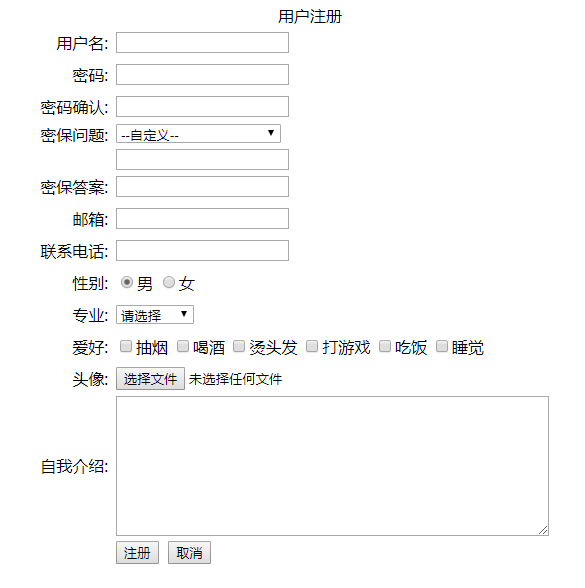
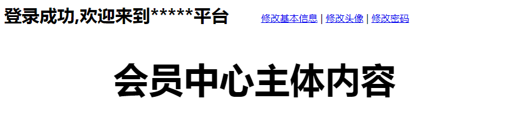

# ASP.NET_WebForm体验

**ASP.NET简介：**

ASP.NET是微软.NET框架提供的一种统一的Web开发模型。

使用ASP.NET服务器控件，可以实现快捷高效的Web开发。

**学习的前置条件：**

（1）HTML+CSS；	

（2）JS+Jquery；	

（3）C#基础语法及面向对象；	

（4）SQL SERVER数据库；

（5）WinForm编程和ADO.NET；

## 一、使用ASP.NET开发会员模块

模块功能如下：

（1）会员注册。

（2）会员登录。

（3）修改信息（修改基本信息，修改头像，修改密码，找回密码）

### （1）数据表结构设计

```
--会员信息
create table MyUser
(
	UserId int primary key identity(1,1), --用户编号
	UserAccount varchar(50) not null, --用户名
	UserPwd varchar(50) not null, --密码
	Question varchar(200) not null, --密保问题
	Answer varchar(200) not null, --问题答案
	UserMail varchar(200) not null, --邮箱
	UserPhone varchar(20) not null, --电话
	UserSex varchar(2) not null, --性别
	UserPro varchar(50) not null, --专业
	UserHobby varchar(200) not null, --爱好
	UserPhoto varchar(100) not null,--头像，照片
	UserSelf text --自我介绍
)
--密保问题
create table MyQuestion
(
	QuestionId int primary key identity(1,1), --密保问题编号
	QuestionTitle varchar(200) not null
)
insert into MyQuestion(QuestionTitle) values('你最喜欢的小姐姐是谁?')
insert into MyQuestion(QuestionTitle) values('你最喜欢的小哥哥是谁?')
insert into MyQuestion(QuestionTitle) values('你小学同桌是谁?')
insert into MyQuestion(QuestionTitle) values('你初中班主任是谁?')
```

### （2）文件目录结构

```
├── App_Code/							--类文件夹
│   ├── DAL/							--数据访问代码文件夹
│	|	├── DBHelper.cs					--数据访问帮助类	
│	|	├── MyUserDAL.cs				--会员信息数据操作代码
│	|	├── MyQuestionDAL.cs			--密码问题数据操作代码
|	├── Entity/							--数据实体文件夹
│	|	├── MyUserEntity.cs				--会员信息用户实体
│	|	├── MyQuestionEntity.cs			--密码问题用户实体
├── img/   								--存放图片素材
├── js/	   								--存放jquery.js
├── uploadimg/   						--存放上传的头像文件
├── Demo01_Reg.aspx   					--会员注册
├── Demo01_Login.aspx   				--会员登录
├── Demo01_Main.aspx    				--会员主界面
├── Demo01_UpdateInfo.aspx   			--修改基本信息
├── Demo01_UpdatePhoto.aspx   			--修改头像
├── Demo01_UpdatePwd.aspx			   	--修改密码
├── Demo01_FindPwd.aspx   				--找回密码
```

### （3）实体类代码

MyUserEntity.cs

```
using System;
using System.Collections.Generic;
using System.Linq;
using System.Web;

/// <summary>
///MyUserEntity 的摘要说明
/// </summary>
public class MyUserEntity
{
	public int UserId{get;set;}  //用户编号
    public string UserAccount { get; set; } //账号
    public string UserPwd { get; set; }
    public string Question { get; set; }
    public string Answer { get; set; }
    public string UserMail { get; set; }
    public string UserPhone { get; set; }
    public string UserSex { get; set; }
    public string UserProfessional { get; set; }
    public string UserHobby { get; set; }
    public string UserPhoto { get; set; }
    public string UserSelf { get; set; }
}
```

MyQuestionEntity.cs

```
using System;
using System.Collections.Generic;
using System.Linq;
using System.Web;

/// <summary>
///MyQuestionEntity 的摘要说明
/// </summary>
public class MyQuestionEntity
{
    public int QuestionId { get; set; }
    public string QuestionTitle { get; set; }
}
```

### （4）数据访问代码

DBHelper.cs

```
using System;
using System.Collections.Generic;
using System.Linq;
using System.Text;
using System.Data.SqlClient;
using System.Data;
using System.Configuration;

public class DBHelper
{
    //SQL连接字符串-SQL身份认证方式登录
    //public static string connStr = "server=.;database=DBTEST;uid=sa;pwd=123456;";

    //SQL连接字符串-Windows身份认证方式登录
    //public static string connStr = "Integrated Security=SSPI;Persist Security Info=False;Initial Catalog=DBTEST;Data Source=.";

    //读取配置文件appSettings节点读取字符串(需要添加引用System.Configuration)
    //public static string connStr = ConfigurationManager.AppSettings["DefaultConn"].ToString();
    //对应的配置文件如下：
    //<appSettings>
    //  <add key="DefaultConn" value="Integrated Security=SSPI;Persist Security Info=False;Initial Catalog=DBTEST;Data Source=."/>
    //</appSettings>

    //读取配置文件ConnectionStrings节点读取字符串(需要添加引用System.Configuration)
    public string connStr = ConfigurationManager.ConnectionStrings["DefaultConn"].ConnectionString;
    //对应配置文件如下：
    //<connectionStrings>
    //    <add name="DefaultConn" connectionString="Integrated Security=SSPI;Persist Security Info=False;Initial Catalog=DBTEST;Data Source=."/>
    //</connectionStrings>

    public SqlConnection conn = null;
    public SqlDataAdapter adp = null;

    #region 连接数据库
    /// <summary>
    /// 连接数据库
    /// </summary>
    public void OpenConn()
    {
        if (conn == null)
        {
            conn = new SqlConnection(connStr);
            conn.Open();
        }
        if (conn.State == System.Data.ConnectionState.Closed)
        {
            conn.Open();
        }
        if (conn.State == System.Data.ConnectionState.Broken)
        {
            conn.Close();
            conn.Open();
        }
    }
    #endregion

    #region 执行SQL语句前准备
    /// <summary>
    /// 准备执行一个SQL语句
    /// </summary>
    /// <param name="sql">需要执行的SQL语句</param>
    public void PrepareSql(string sql)
    {
        OpenConn(); //打开数据库连接
        adp = new SqlDataAdapter(sql, conn);
    }
    /// <summary>
    /// 准备执行一个存储过程
    /// </summary>
    /// <param name="sql">存储过程名字</param>
    public void PrepareProc(string sql)
    {
        OpenConn(); //打开数据库连接
        adp = new SqlDataAdapter(sql, conn);
        adp.SelectCommand.CommandType = CommandType.StoredProcedure;
    }
    #endregion

    #region 设置和获取sql语句的参数
    /// <summary>
    /// 设置传入参数
    /// </summary>
    /// <param name="parameterName">参数名称</param>
    /// <param name="parameterValue">参数值</param>
    public void SetParameter(string parameterName, object parameterValue)
    {
        parameterName = "@" + parameterName.Trim();
        if (parameterValue == null)
            parameterValue = DBNull.Value;
        adp.SelectCommand.Parameters.Add(new SqlParameter(parameterName, parameterValue));
    }
    /// <summary>
    /// 设置输出参数（不指定长度，适合非字符串）
    /// </summary>
    /// <param name="parameterName">参数名称</param>
    /// <param name="dbType">参数类型</param>
    public void SetOutParameter(string parameterName, SqlDbType dbType)
    {
        parameterName = "@" + parameterName.Trim();
        SqlParameter parameter = new SqlParameter(parameterName, dbType);
        parameter.Direction = ParameterDirection.Output;
        adp.SelectCommand.Parameters.Add(parameter);
    }
    /// <summary>
    /// 设置输出参数（指定长度，适合字符串）
    /// </summary>
    /// <param name="parameterName">参数名称</param>
    /// <param name="dbType">参数类型</param>
    /// <param name="size">参数长度</param>
    public void SetOutParameter(string parameterName, SqlDbType dbType, int size)
    {
        parameterName = "@" + parameterName.Trim();
        SqlParameter parameter = new SqlParameter(parameterName, dbType, size);
        parameter.Direction = ParameterDirection.Output;
        adp.SelectCommand.Parameters.Add(parameter);
    }
    /// <summary>
    /// 设置返回值参数
    /// </summary>
    /// <param name="parameterName">参数名称</param>
    public void SetReturnParameter(string parameterName)
    {
        parameterName = "@" + parameterName.Trim();
        SqlParameter parameter = new SqlParameter();
        parameter.ParameterName = parameterName;
        parameter.Direction = ParameterDirection.ReturnValue;
        adp.SelectCommand.Parameters.Add(parameter);
    }
    /// <summary>
    /// 获取参数内容值
    /// </summary>
    /// <param name="parameterName">参数名称</param>
    /// <returns>参数值</returns>
    public object GetParameter(string parameterName)
    {
        parameterName = "@" + parameterName.Trim();
        return adp.SelectCommand.Parameters[parameterName].Value;
    }
    #endregion

    #region 执行SQL语句
    /// <summary>
    /// 执行非查询SQL语句
    /// </summary>
    /// <returns>受影响行数</returns>
    public int ExecNonQuery()
    {
        int result = adp.SelectCommand.ExecuteNonQuery();
        conn.Close();
        return result;
    }
    /// <summary>
    /// 执行查询SQL语句
    /// </summary>
    /// <returns>DataTable类型查询结果</returns>
    public DataTable ExecQuery()
    {
        DataTable dt = new DataTable();
        adp.Fill(dt);
        conn.Close();
        return dt;
    }
    /// <summary>
    /// 执行查询SQL语句
    /// </summary>
    /// <returns>SqlDataReader类型查询结果,SqlDataReader需要手动关闭</returns>
    public SqlDataReader ExecDataReader()
    {
        return adp.SelectCommand.ExecuteReader(CommandBehavior.CloseConnection);
    }
    /// <summary>
    /// 执行查询SQL语句
    /// </summary>
    /// <returns>查询结果第一行第一列</returns>
    public object ExecScalar()
    {
        object obj = adp.SelectCommand.ExecuteScalar();
        conn.Close();
        return obj;
    }
    #endregion

}
```

MyQuestionDAL.cs

```
using System;
using System.Collections.Generic;
using System.Linq;
using System.Web;
using System.Data;

/// <summary>
///MyQuestionDAL 的摘要说明
/// </summary>
public class MyQuestionDAL
{
    DBHelper db = new DBHelper();

    #region 列表
    public List<MyQuestionEntity> List()
    {
        string sql = "select * from MyQuestion";
        db.PrepareSql(sql);
        DataTable dt = new DataTable();
        dt = db.ExecQuery();
        List<MyQuestionEntity> list = new List<MyQuestionEntity>();
        foreach (DataRow dr in dt.Rows)
        {
            MyQuestionEntity entity = new MyQuestionEntity();
            entity.QuestionId = int.Parse(dr["QuestionId"].ToString());
            entity.QuestionTitle = dr["QuestionTitle"].ToString();
            list.Add(entity);
        }
        return list;
    }
    #endregion
}
```

MyUserDAL.cs

```
using System;
using System.Collections.Generic;
using System.Linq;
using System.Web;
using System.Data;

/// <summary>
///MyUserDAL 的摘要说明
/// </summary>
public class MyUserDAL
{
    DBHelper db = new DBHelper();

    #region 添加
    public int Add(MyUserEntity entity)
    {
        string sql = "insert into MyUser(UserAccount,UserPwd,Question,Answer,UserMail,UserPhone,UserSex,UserProfessional,UserHobby,UserPhoto,UserSelf) values(@UserAccount,@UserPwd,@Question,@Answer,@UserMail,@UserPhone,@UserSex,@UserProfessional,@UserHobby,@UserPhoto,@UserSelf)";
        db.PrepareSql(sql);
        db.SetParameter("UserAccount", entity.UserAccount);
        db.SetParameter("UserPwd", entity.UserPwd);
        db.SetParameter("Question", entity.Question);
        db.SetParameter("Answer", entity.Answer);
        db.SetParameter("UserMail", entity.UserMail);
        db.SetParameter("UserPhone", entity.UserPhone);
        db.SetParameter("UserSex", entity.UserSex);
        db.SetParameter("UserProfessional", entity.UserProfessional);
        db.SetParameter("UserHobby", entity.UserHobby);
        db.SetParameter("UserPhoto", entity.UserPhoto);
        db.SetParameter("UserSelf", entity.UserSelf);
        return db.ExecNonQuery();
    }
    #endregion

    #region 删除
    public int Delete(int id)
    {
        string sql = "delete from MyUser where UserId = " + id;
        db.PrepareSql(sql);
        return db.ExecNonQuery();
    }
    #endregion

    #region 修改
    public int Update(MyUserEntity entity)
    {
        string sql = "update MyUser set UserAccount=@UserAccount,UserPwd=@UserPwd,Question=@Question,Answer=@Answer,UserMail=@UserMail,UserPhone=@UserPhone,UserSex=@UserSex,UserProfessional=@UserProfessional,UserHobby=@UserHobby,UserPhoto=@UserPhoto,UserSelf=@UserSelf where UserId=@UserId";
        db.PrepareSql(sql);
        db.SetParameter("UserAccount", entity.UserAccount);
        db.SetParameter("UserPwd", entity.UserPwd);
        db.SetParameter("Question", entity.Question);
        db.SetParameter("Answer", entity.Answer);
        db.SetParameter("UserMail", entity.UserMail);
        db.SetParameter("UserPhone", entity.UserPhone);
        db.SetParameter("UserSex", entity.UserSex);
        db.SetParameter("UserProfessional", entity.UserProfessional);
        db.SetParameter("UserHobby", entity.UserHobby);
        db.SetParameter("UserPhoto", entity.UserPhoto);
        db.SetParameter("UserSelf", entity.UserSelf);
        db.SetParameter("UserId", entity.UserId);
        return db.ExecNonQuery();
    }
    #endregion

    #region 列表
    public List<MyUserEntity> List()
    {
        string sql = "select * from MyUser";
        db.PrepareSql(sql);
        DataTable dt = new DataTable();
        dt = db.ExecQuery();
        List<MyUserEntity> list = new List<MyUserEntity>();
        foreach (DataRow item in dt.Rows)
        {
            MyUserEntity entity = new MyUserEntity();
            entity.UserId = int.Parse(item["UserId"].ToString());
            entity.UserAccount = item["UserAccount"].ToString();
            entity.UserPwd = item["UserPwd"].ToString();
            entity.Question = item["Question"].ToString();
            entity.Answer = item["Answer"].ToString();
            entity.UserMail = item["UserMail"].ToString();
            entity.UserPhone = item["UserPhone"].ToString();
            entity.UserSex = item["UserSex"].ToString();
            entity.UserProfessional = item["UserProfessional"].ToString();
            entity.UserHobby = item["UserHobby"].ToString();
            entity.UserPhoto = item["UserPhoto"].ToString();
            entity.UserSelf = item["UserSelf"].ToString();
            list.Add(entity);
        }
        return list;
    }
    public DataTable Select()
    {
        string sql = "select * from MyUser";
        db.PrepareSql(sql);
        DataTable dt = new DataTable();
        dt = db.ExecQuery();
        return dt;
    }
    #endregion

    #region 详情
    public MyUserEntity Detail(int id)
    {
        string sql = "select * from MyUser where UserId = " + id;
        db.PrepareSql(sql);
        DataTable dt = new DataTable();
        dt = db.ExecQuery();
        if (dt.Rows.Count == 0)
            return null;
        MyUserEntity entity = new MyUserEntity();
        entity.UserId = int.Parse(dt.Rows[0]["UserId"].ToString());
        entity.UserAccount = dt.Rows[0]["UserAccount"].ToString();
        entity.UserPwd = dt.Rows[0]["UserPwd"].ToString();
        entity.Question = dt.Rows[0]["Question"].ToString();
        entity.Answer = dt.Rows[0]["Answer"].ToString();
        entity.UserMail = dt.Rows[0]["UserMail"].ToString();
        entity.UserPhone = dt.Rows[0]["UserPhone"].ToString();
        entity.UserSex = dt.Rows[0]["UserSex"].ToString();
        entity.UserProfessional = dt.Rows[0]["UserProfessional"].ToString();
        entity.UserHobby = dt.Rows[0]["UserHobby"].ToString();
        entity.UserPhoto = dt.Rows[0]["UserPhoto"].ToString();
        entity.UserSelf = dt.Rows[0]["UserSelf"].ToString();
        return entity;
    }
    public MyUserEntity Detail(string account)
    {
        string sql = "select * from MyUser where UserAccount = '" + account + "'";
        db.PrepareSql(sql);
        DataTable dt = new DataTable();
        dt = db.ExecQuery();
        if (dt.Rows.Count == 0)
            return null;
        MyUserEntity entity = new MyUserEntity();
        entity.UserId = int.Parse(dt.Rows[0]["UserId"].ToString());
        entity.UserAccount = dt.Rows[0]["UserAccount"].ToString();
        entity.UserPwd = dt.Rows[0]["UserPwd"].ToString();
        entity.Question = dt.Rows[0]["Question"].ToString();
        entity.Answer = dt.Rows[0]["Answer"].ToString();
        entity.UserMail = dt.Rows[0]["UserMail"].ToString();
        entity.UserPhone = dt.Rows[0]["UserPhone"].ToString();
        entity.UserSex = dt.Rows[0]["UserSex"].ToString();
        entity.UserProfessional = dt.Rows[0]["UserProfessional"].ToString();
        entity.UserHobby = dt.Rows[0]["UserHobby"].ToString();
        entity.UserPhoto = dt.Rows[0]["UserPhoto"].ToString();
        entity.UserSelf = dt.Rows[0]["UserSelf"].ToString();
        return entity;
    }
    #endregion


    #region 检查用户名是否可用（是否存在，存在不可用，不存在可用）
    public bool IsAccCanUse(string strAccount)
    {
        string sql = "select count(*) from MyUser where UserAccount= '" + strAccount + "'";
        db.PrepareSql(sql);
        int count = (int)db.ExecScalar();
        if (count == 0)
            return true;
        else
            return false;
    }
    #endregion

    #region 登录
    public MyUserEntity Login(string acc, string pwd)
    {
        string sql = "select * from MyUser where UserAccount=@UserAccount and UserPwd=@UserPwd";
        db.PrepareSql(sql);
        db.SetParameter("UserAccount", acc);
        db.SetParameter("UserPwd", pwd);
        DataTable dt = new DataTable();
        dt = db.ExecQuery();
        if (dt.Rows.Count == 1) //成功
        {
            MyUserEntity entity = new MyUserEntity();
            entity.UserId = int.Parse(dt.Rows[0]["UserId"].ToString());
            entity.UserAccount = dt.Rows[0]["UserAccount"].ToString();
            entity.UserPwd = dt.Rows[0]["UserPwd"].ToString();
            entity.Question = dt.Rows[0]["Question"].ToString();
            entity.Answer = dt.Rows[0]["Answer"].ToString();
            entity.UserMail = dt.Rows[0]["UserMail"].ToString();
            entity.UserPhone = dt.Rows[0]["UserPhone"].ToString();
            entity.UserSex = dt.Rows[0]["UserSex"].ToString();
            entity.UserProfessional = dt.Rows[0]["UserProfessional"].ToString();
            entity.UserHobby = dt.Rows[0]["UserHobby"].ToString();
            entity.UserPhoto = dt.Rows[0]["UserPhoto"].ToString();
            entity.UserSelf = dt.Rows[0]["UserSelf"].ToString();
            return entity;
        }
        else
        {
            return null;
        }
    }
    #endregion
}
```


### （5）会员注册

**页面效果：**



**HTML代码：**

```
<%@ Page Language="C#" AutoEventWireup="true" CodeFile="Demo01_Reg.aspx.cs" Inherits="Demo01_Reg" %>
<!DOCTYPE html PUBLIC "-//W3C//DTD XHTML 1.0 Transitional//EN" "http://www.w3.org/TR/xhtml1/DTD/xhtml1-transitional.dtd">
<html xmlns="http://www.w3.org/1999/xhtml">
<head runat="server">
    <title>用户注册</title>
    <style type="text/css">
            div,ul,li,table,tr,td{margin:0px; padding:0px;}
			.errInfo{color: red; font-size: 12px;}
			.errInfo img{ vertical-align:middle;}
			#form1 td{ padding-left:6px;}
			#txtQuestion{ margin-top:6px;}
			#rbListSex td{margin:0px; padding:0px;}
			#ckbListHobby td{margin:0px; padding:0px;}
    </style>
    <script src="js/jquery.js" type="text/javascript"></script>
    <script type="text/javascript">
        $(function () {
            //选择密保问题下拉框绑定文本框的值
            $("#ddlQuestion").change(function () {
                if ($(this).val() == 0)
                    $("#txtQuestion").val("");
                else {
                    //var txt = $(this).find("option:selected").text()
                    //$("#txtQuestion").val(txt);
                    $("#txtQuestion").val($(this).val());
                }
            })
        })      
    </script>
</head>
<body>
    <form id="form1" runat="server">
		<table width="1000" align="center">
			<caption>用户注册</caption>
			<tr>
				<td width="300" align="right" height="30">用户名:</td>
				<td width="700"><asp:TextBox ID="txtAccount" runat="server"></asp:TextBox>
				</td>
			</tr>
			<tr>
				<td width="300" align="right" height="30">密码:</td>
				<td width="700"><asp:TextBox ID="txtPwd" runat="server" TextMode="Password"></asp:TextBox>
					<span id="spanPwd" class="errInfo"></span>
				</td>
			</tr>
			<tr>
				<td width="300" align="right" height="30">密码确认:</td>
				<td width="700"><asp:TextBox ID="txtPwdOk" runat="server" TextMode="Password"></asp:TextBox>
					<span id="spanPwdOk" class="errInfo"></span>
				</td>
			</tr>
			<tr>
				<td width="300" align="right" height="30" style=" vertical-align:top;">密保问题:</td>
				<td width="700">
                    <asp:DropDownList ID="ddlQuestion" runat="server">
                    </asp:DropDownList><br />
                    <asp:TextBox ID="txtQuestion" runat="server"></asp:TextBox>
					<span id="spanQuestion" class="errInfo"></span>
				</td>
			</tr>
			<tr>
				<td width="300" align="right" height="30">密保答案:</td>
				<td width="700"><asp:TextBox ID="txtAnswer" runat="server"></asp:TextBox>
					<span id="spanAnswer" class="errInfo"></span>
				</td>
			</tr>
			<tr>
				<td width="300" align="right" height="30">邮箱:</td>
				<td width="700"><asp:TextBox ID="txtMail" runat="server"></asp:TextBox>
					<span id="spanMail" class="errInfo"></span>
				</td>
			</tr>
			<tr>
				<td width="300" align="right" height="30">联系电话:</td>
				<td width="700"><asp:TextBox ID="txtPhone" runat="server"></asp:TextBox>
					<span id="spanPhone" class="errInfo"></span>
				</td>
			</tr>			
			<tr>
				<td width="300" align="right" height="30">性别:</td>
				<td width="700" align="left">
					<asp:RadioButton ID="rbBoy" runat="server" Text="男" Checked="true" GroupName="sex" />
                    <asp:RadioButton ID="rbGirl" runat="server" Text="女" GroupName="sex" />
                    <span id="spanSex" class="errInfo"></span>
				</td>
			</tr>
			<tr>
				<td width="300" align="right" height="30">专业:</td>
				<td width="700">
					<asp:DropDownList ID="ddlProfessional" runat="server">
                        <asp:ListItem>请选择</asp:ListItem>
                        <asp:ListItem>软件开发</asp:ListItem>
                        <asp:ListItem>电子商务</asp:ListItem>
                        <asp:ListItem>国际贸易</asp:ListItem>
                        <asp:ListItem>工商管理</asp:ListItem>
                        <asp:ListItem>高级护理</asp:ListItem>
                    </asp:DropDownList>
					<span id="spanProfessional" class="errInfo"></span>
				</td>
			</tr>			
			<tr>
				<td width="300" align="right" height="30">爱好:</td>
				<td width="700" align="left">
                    <asp:Panel ID="pHobby" runat="server">
                        <asp:CheckBox ID="ckHobby1" runat="server" Text="抽烟" />
                        <asp:CheckBox ID="ckHobby2" runat="server" Text="喝酒" />
                        <asp:CheckBox ID="ckHobby3" runat="server" Text="烫头发" />
                        <asp:CheckBox ID="ckHobby4" runat="server" Text="打游戏" />
                        <asp:CheckBox ID="ckHobby5" runat="server" Text="吃饭" />
                        <asp:CheckBox ID="ckHobby6" runat="server" Text="睡觉" />
                    </asp:Panel>
				</td>
			</tr>
			<tr>
				<td width="300" align="right" height="30">头像:</td>
				<td width="700" align="left">
                    <asp:FileUpload ID="filePhoto" runat="server" />
					<span id="spanPhoto" class="errInfo" runat="server"></span>
				</td>
			</tr>
			<tr>
				<td width="300" align="right" height="30">自我介绍:</td>
				<td width="700">
					<asp:TextBox ID="txtSelft" runat="server" Height="134px" TextMode="MultiLine" 
                        Width="427px"></asp:TextBox>
				</td>
			</tr>
			<tr>
				<td width="300" align="right" height="30">&nbsp;</td>
				<td width="700">
					<asp:Button ID="btReg" runat="server" Text="注册" onclick="btReg_Click"  />
&nbsp;<input type="reset" value="取消" />
                    <asp:Label ID="lblInfo" runat="server" ForeColor="#CC0000"></asp:Label>
				</td>
			</tr>
		</table>
    </form>
</body>
</html>
```

C#代码：

```
using System;
using System.Collections.Generic;
using System.Linq;
using System.Web;
using System.Web.UI;
using System.Web.UI.WebControls;
using System.Data;

public partial class Demo01_Reg : System.Web.UI.Page
{
    protected void Page_Load(object sender, EventArgs e)
    {
        if (!IsPostBack)   //非页面回调
        {
            BindQuestion();
        }
    }

    #region 绑定密码问题
    private void BindQuestion()
    {
        MyQuestionDAL dal = new MyQuestionDAL();
        this.ddlQuestion.DataSource = dal.List();
        this.ddlQuestion.DataValueField = "QuestionId";
        this.ddlQuestion.DataTextField = "QuestionTitle";
        this.ddlQuestion.DataBind();
        this.ddlQuestion.Items.Insert(0, new ListItem("--自定义--", "0"));
    }
    #endregion

    #region 注册
    protected void btReg_Click(object sender, EventArgs e)
    {
        MyUserDAL dal = new MyUserDAL();
        //判断用户名是否被占用
        if (dal.IsAccCanUse(this.txtAccount.Text) == false)
        {
            this.lblInfo.Text = "用户名被占用";
            return;
        }
        //实体类赋值
        MyUserEntity entity = new MyUserEntity();
        entity.UserAccount = this.txtAccount.Text;
        entity.UserPwd = this.txtPwd.Text;
        entity.Question = this.txtQuestion.Text;
        entity.Answer = this.txtAnswer.Text;
        entity.UserMail = this.txtMail.Text;
        entity.UserPhone = this.txtPhone.Text;
        entity.UserSex = this.rbBoy.Checked == true ? "男" : "女";
        entity.UserProfessional = this.ddlProfessional.SelectedItem.Text;
        //爱好
        string strHobby = "";
        foreach (var item in this.pHobby.Controls)
        {
            if (item.GetType() == typeof(CheckBox))
            {
                if (((CheckBox)item).Checked == true)
                {
                    if (!strHobby.Equals(""))
                        strHobby += ",";
                    strHobby += ((CheckBox)item).Text;
                }
            }
        }
        entity.UserHobby = strHobby;
        //上传文件（需要判断文件后缀名和文件内容是否为图片，后期上传文件课程中单独演示）
        if (this.filePhoto.HasFile)
        {
            string fileName = this.filePhoto.FileName;  //取文件名  *****.*****.png
            string[] arrFileName = fileName.Split('.');
            string fileFix = arrFileName[arrFileName.Length - 1];   //取文件后缀名
            string serverFileName = DateTime.Now.ToString("yyyyMMddhhmmssfff") + "." + fileFix;
            string serverPath = Server.MapPath("uploadimg");
            string serverFullName = serverPath + "\\" + serverFileName;
            this.filePhoto.SaveAs(serverFullName);  //必须是物理路径
            entity.UserPhoto = serverFileName;
        }
        entity.UserSelf = this.txtSelft.Text;
        dal.Add(entity);
        ClientScript.RegisterStartupScript(this.GetType(), "JS", "<script>alert('注册成功');window.location.href='Demo01_Login.aspx';</script>");
    }
    #endregion
}
```

### （6）会员登录

**页面效果：**


**HTML代码：**

```
<%@ Page Language="C#" AutoEventWireup="true" CodeFile="Demo01_Login.aspx.cs" Inherits="Demo01_Login" %>
<!DOCTYPE html PUBLIC "-//W3C//DTD XHTML 1.0 Transitional//EN" "http://www.w3.org/TR/xhtml1/DTD/xhtml1-transitional.dtd">
<html xmlns="http://www.w3.org/1999/xhtml">
<head runat="server">
    <title>用户登录</title>
    <style type="text/css">
        #container{ text-align:center;}
        .righttd
        {
            width: 460px;
        }
        .lefted
        {
            width: 196px;
        }
        .mytitle{ font-size:18px; font-weight:bold;}
    </style>
</head>
<body>
    <form id="form1" runat="server">
    <div id="container">
        <table>
            <tr>
                <td align="center" height="30" class="mytitle" colspan="2">用户登录</td>
            </tr>
            <tr>
                <td align="right" class="lefted" height="30">用户名:</td>
                <td align="left" class="righttd" height="30">
                    <asp:TextBox ID="txtAccount" runat="server"></asp:TextBox>
                </td>
            </tr>
            <tr>
                <td align="right" class="lefted" height="30">密码:</td>
                <td align="left" class="righttd" height="30">
                    <asp:TextBox ID="txtPwd" runat="server" TextMode="Password"></asp:TextBox>
                </td>
            </tr>
            <tr runat="server" id="trValidate" clientidmode="Static">
                <td align="right" class="lefted" height="30">验证码:</td>
                <td align="left" class="righttd" height="30">
                    <asp:TextBox ID="txtValidate" runat="server" Width="72px"></asp:TextBox>
                    <asp:Label ID="lblValidate" runat="server"></asp:Label>
                </td>
            </tr>
            <tr>
                <td align="right" class="lefted" height="30"></td>
                <td align="left" class="righttd" height="30">
                    <asp:Button ID="btLogin" runat="server" onclick="btLogin_Click" Text="登  录" />
                    <asp:HyperLink ID="hlinkReg" runat="server" NavigateUrl="~/Demo01_Reg.aspx">注册</asp:HyperLink>
                    <asp:HyperLink ID="hlinkFindPwd" runat="server" 
                        NavigateUrl="~/Demo01_FindPwd.aspx">找回密码</asp:HyperLink>
                </td>
            </tr>
            <tr>
                <td align="right" class="lefted" height="30"></td>
                <td align="left" class="righttd" height="30">
                    <asp:Label ID="lblErrInfo" runat="server" ForeColor="Red"></asp:Label>
                </td>
            </tr>
        </table>
    </div>
    </form>
</body>
</html>
```

**C#代码：**

```
using System;
using System.Collections.Generic;
using System.Linq;
using System.Web;
using System.Web.UI;
using System.Web.UI.WebControls;

public partial class Demo01_Login : System.Web.UI.Page
{
    protected void Page_Load(object sender, EventArgs e)
    {
        if (!IsPostBack) //不是页面回传
            this.lblValidate.Text = GetRandomValidate(5);
        //this.trValidate.Visible = false;
    }

    #region 传入长度,产生该长度下的验证码
    private string GetRandomValidate(int len)
    {
        string result = "";
        Random rd = new Random();
        string strList = "abcdefghijkmnprstuvwxyzABCDEFGHJKLMNPQRSTUVWXYZ0123456789";
        for (int i = 1; i <= len; i++)
        {
            result += strList[rd.Next(0, strList.Length)];
        }
        return result;
    }
    #endregion

    #region 登录按钮
    protected void btLogin_Click(object sender, EventArgs e)
    {
        if (this.txtValidate.Text.Trim().ToLower().Equals(this.lblValidate.Text.Trim().ToLower()) == false)
        {
            this.lblErrInfo.Text = "验证码错误!";
            this.lblValidate.Text = GetRandomValidate(5);
            return;
        }
        //判断用户名密码是否正确
        MyUserDAL dal = new MyUserDAL();
        MyUserEntity entity = new MyUserEntity();
        entity = dal.Login(this.txtAccount.Text, this.txtPwd.Text);
        if (entity == null)
        {
            this.lblErrInfo.Text = "用户名或密码错误!";
            this.lblValidate.Text = GetRandomValidate(5);
            return;
        }
        Session["MyUser"] = entity;
        Response.Redirect("Demo01_Main.aspx");
    }
    #endregion
}
```

### （7）会员主界面

**页面效果：**



**HTML代码：**

```
<%@ Page Language="C#" AutoEventWireup="true" CodeFile="Demo01_Main.aspx.cs" Inherits="Demo01_Main" %>
<!DOCTYPE html PUBLIC "-//W3C//DTD XHTML 1.0 Transitional//EN" "http://www.w3.org/TR/xhtml1/DTD/xhtml1-transitional.dtd">
<html xmlns="http://www.w3.org/1999/xhtml">
<head runat="server">
    <title>登录成功</title>
    <style type="text/css">
        #welcome{ font-size:30px; font-weight:bold;}
        #updateLink{ margin-left:50px; }
        #content{ text-align:center; padding-top:50px; font-size:60px;font-weight:bold;}
    </style>
</head>
<body>
    <form id="form1" runat="server">
    <div>
        <span id="welcome">登录成功,欢迎来到*****平台</span>
        <span id="updateLink">
            <a href="Demo01_UpdateInfo.aspx" target="_blank">修改基本信息</a> | 
            <a href="Demo01_UpdatePhoto.aspx" target="_blank">修改头像</a> | 
            <a href="Demo01_UpdatePwd.aspx" target="_blank">修改密码</a> 
        </span>
    </div>
    <div id="content">
        会员中心主体内容
    </div>
    </form>
</body>
</html>
```

**C#代码：无**

### （8）基本信息修改

**页面效果：**


**HTML代码：**

```
<%@ Page Language="C#" AutoEventWireup="true" CodeFile="Demo01_UpdateInfo.aspx.cs" Inherits="Demo01_UpdateInfo" %>
<!DOCTYPE html PUBLIC "-//W3C//DTD XHTML 1.0 Transitional//EN" "http://www.w3.org/TR/xhtml1/DTD/xhtml1-transitional.dtd">
<html xmlns="http://www.w3.org/1999/xhtml">
<head runat="server">
    <title>修改个人信息</title>
    <style type="text/css">
            div,ul,li,table,tr,td{margin:0px; padding:0px;}
			.errInfo{color: red; font-size: 12px;}
			.errInfo img{ vertical-align:middle;}
			#form1 td{ padding-left:6px;}
			#txtQuestion{ margin-top:6px;}
			#rbListSex td{margin:0px; padding:0px;}
			#ckbListHobby td{margin:0px; padding:0px;}
    </style>
</head>
<body>
    <form id="form1" runat="server">
        <asp:HiddenField ID="hdUserId" runat="server" />
		<table width="1000" align="center">
			<caption>用户基本信息修改</caption>
			<tr>
				<td width="300" align="right" height="30">用户名:</td>
				<td width="700">
                    <asp:Label ID="lblAccount" runat="server"></asp:Label>
				</td>
			</tr>
			<tr>
				<td width="300" align="right" height="30">邮箱:</td>
				<td width="700"><asp:TextBox ID="txtMail" runat="server"></asp:TextBox>
					<span id="spanMail" class="errInfo"></span>
				</td>
			</tr>
			<tr>
				<td width="300" align="right" height="30">联系电话:</td>
				<td width="700"><asp:TextBox ID="txtPhone" runat="server"></asp:TextBox>
					<span id="spanPhone" class="errInfo"></span>
				</td>
			</tr>			
			<tr>
				<td width="300" align="right" height="30">性别:</td>
				<td width="700" align="left">
					<asp:RadioButtonList ID="rbListSex" runat="server" RepeatDirection="Horizontal">
                        <asp:ListItem Value="男">男</asp:ListItem>
                        <asp:ListItem Value="女">女</asp:ListItem>
                    </asp:RadioButtonList>
                    <span id="spanSex" class="errInfo"></span>
				</td>
			</tr>
			<tr>
				<td width="300" align="right" height="30">专业:</td>
				<td width="700">
					<asp:DropDownList ID="ddlProfessional" runat="server">
                        <asp:ListItem>请选择</asp:ListItem>
                        <asp:ListItem>软件开发</asp:ListItem>
                        <asp:ListItem>电子商务</asp:ListItem>
                        <asp:ListItem>国际贸易</asp:ListItem>
                        <asp:ListItem>工商管理</asp:ListItem>
                        <asp:ListItem>高级护理</asp:ListItem>
                    </asp:DropDownList>
					<span id="spanProfessional" class="errInfo"></span>
				</td>
			</tr>			
			<tr>
				<td width="300" align="right" height="30">爱好:</td>
				<td width="700" align="left">
                    <asp:Panel ID="pHobby" runat="server">
                        <asp:CheckBox ID="ckHobby1" runat="server" Text="抽烟" />
                        <asp:CheckBox ID="ckHobby2" runat="server" Text="喝酒" />
                        <asp:CheckBox ID="ckHobby3" runat="server" Text="烫头发" />
                        <asp:CheckBox ID="ckHobby4" runat="server" Text="打游戏" />
                        <asp:CheckBox ID="ckHobby5" runat="server" Text="吃饭" />
                        <asp:CheckBox ID="ckHobby6" runat="server" Text="睡觉" />
                    </asp:Panel>
				</td>
			</tr>
			<tr>
				<td width="300" align="right" height="30">自我介绍:</td>
				<td width="700">
					<asp:TextBox ID="txtSelft" runat="server" Height="153px" TextMode="MultiLine" Width="427px"></asp:TextBox>
				</td>
			</tr>
			<tr>
				<td width="300" align="right" height="30">&nbsp;</td>
				<td width="700">
					<asp:Button ID="btReg" runat="server" Text="修改基本信息" 
                        onclick="btReg_Click" />
&nbsp;<input type="reset" value="取消" />
				</td>
			</tr>
		</table>
    </form>
</body>
</html>
```

C#代码：

```
using System;
using System.Collections.Generic;
using System.Linq;
using System.Web;
using System.Web.UI;
using System.Web.UI.WebControls;

public partial class Demo01_UpdateInfo : System.Web.UI.Page
{
    protected void Page_Load(object sender, EventArgs e)
    {
        if (!IsPostBack)
        {
            BindDetail();
        }
    }

    #region 绑定用户信息
    private void BindDetail()
    {
        //判断登录
        if (Session["MyUser"] == null)
        {
            Response.Redirect("Demo01_Login.aspx");
            return;
        }
        //查详情
        MyUserDAL dal = new MyUserDAL();
        MyUserEntity entity = new MyUserEntity();
        int UserId = ((MyUserEntity)Session["MyUser"]).UserId;
        entity = dal.Detail(UserId);

        this.hdUserId.Value = entity.UserId.ToString();
        this.lblAccount.Text = entity.UserAccount;
        this.txtMail.Text = entity.UserMail;
        this.txtPhone.Text = entity.UserPhone;
        this.rbListSex.Text = entity.UserSex;
        this.ddlProfessional.SelectedValue = entity.UserProfessional;
        foreach (var item in this.pHobby.Controls)
        {
            if (item.GetType() == typeof(CheckBox))
            {
                if (entity.UserHobby.Split(',').Contains(((CheckBox)item).Text))
                {
                    ((CheckBox)item).Checked = true;
                }
            }
        }
        this.txtSelft.Text = entity.UserSelf;
    }
    #endregion
    
    #region 修改基本信息
    protected void btReg_Click(object sender, EventArgs e)
    {
        //判断登录
        if (Session["MyUser"] == null)
        {
            Response.Redirect("Demo01_Login.aspx");
            return;
        }
        //查详情
        MyUserDAL dal = new MyUserDAL();
        MyUserEntity entity = new MyUserEntity();
        entity = dal.Detail(int.Parse(this.hdUserId.Value));
        //修改
        entity.UserMail = this.txtMail.Text;
        entity.UserPhone = this.txtPhone.Text;
        entity.UserSex = this.rbListSex.Text;
        entity.UserProfessional = this.ddlProfessional.SelectedValue;
        //爱好
        string strHobby = "";
        foreach (var item in this.pHobby.Controls)
        {
            if (item.GetType() == typeof(CheckBox))
            {
                if (((CheckBox)item).Checked == true)
                {
                    if (!strHobby.Equals(""))
                        strHobby += ",";
                    strHobby += ((CheckBox)item).Text;
                }
            }
        }
        entity.UserHobby = strHobby;
        entity.UserSelf = this.txtSelft.Text;
        dal.Update(entity);
        ClientScript.RegisterStartupScript(this.GetType(), "JS", "<script>alert('基本信息修改成功');window.location.href='Demo01_UpdateInfo.aspx';</script>");
    }
    #endregion
}
```

### （9）头像修改

**页面效果：**


**HTML代码：**

```
<%@ Page Language="C#" AutoEventWireup="true" CodeFile="Demo01_UpdatePhoto.aspx.cs" Inherits="Demo01_UpdatePhoto" %>
<!DOCTYPE html PUBLIC "-//W3C//DTD XHTML 1.0 Transitional//EN" "http://www.w3.org/TR/xhtml1/DTD/xhtml1-transitional.dtd">
<html xmlns="http://www.w3.org/1999/xhtml">
<head runat="server">
    <title>修改个人头像</title>
    <style type="text/css">
            div,ul,li,table,tr,td{margin:0px; padding:0px;}
			.errInfo{color: red; font-size: 12px;}
			.errInfo img{ vertical-align:middle;}
			#form1 td{ padding-left:6px;}
			#txtQuestion{ margin-top:6px;}
			#rbListSex td{margin:0px; padding:0px;}
			#ckbListHobby td{margin:0px; padding:0px;}
    </style>
</head>
<body>
    <form id="form1" runat="server">
        <asp:HiddenField ID="hdUserId" runat="server" />
		<table width="1000" align="center">
			<caption>修改头像</caption>
			<tr>
				<td width="300" align="right" height="30">头像:</td>
				<td width="700" align="left">
                    <asp:FileUpload ID="filePhoto" runat="server" />
                    <asp:Button ID="btReg" runat="server" Text="修改头像" 
                        onclick="btReg_Click" />
					<span id="spanPhoto" class="errInfo" runat="server"></span>
				</td>
			</tr>
			<tr>
				<td width="300" align="right" height="30">&nbsp;</td>
				<td width="700">
                    <asp:Image ID="imgPhoto" runat="server" Width="100" Height="100" />
				</td>
			</tr>
		</table>
    </form>
</body>
</html>
```

**C#代码：**

```
using System;
using System.Collections.Generic;
using System.Linq;
using System.Web;
using System.Web.UI;
using System.Web.UI.WebControls;

public partial class Demo01_UpdatePhoto : System.Web.UI.Page
{
    protected void Page_Load(object sender, EventArgs e)
    {
        if (!IsPostBack)
        {
            BindDetail();
        }
    }

    #region 绑定用户信息
    private void BindDetail()
    {
        //判断登录
        if (Session["MyUser"] == null)
        {
            Response.Redirect("Demo01_Login.aspx");
            return;
        }
        //查详情
        MyUserDAL dal = new MyUserDAL();
        MyUserEntity entity = new MyUserEntity();
        int UserId = ((MyUserEntity)Session["MyUser"]).UserId;
        entity = dal.Detail(UserId);
        this.hdUserId.Value = entity.UserId.ToString();
        this.imgPhoto.ImageUrl = "uploadimg/" + entity.UserPhoto;
    }
    #endregion

    #region 修改头像
    protected void btReg_Click(object sender, EventArgs e)
    {
        //判断登录
        if (Session["MyUser"] == null)
        {
            Response.Redirect("Demo01_Login.aspx");
            return;
        }
        //查详情
        MyUserDAL dal = new MyUserDAL();
        MyUserEntity entity = new MyUserEntity();
        entity = dal.Detail(int.Parse(this.hdUserId.Value));
        //上传图像
        if (filePhoto.HasFile == true)
        {
            string fileName = this.filePhoto.FileName;  //取文件名  *****.*****.png
            string[] arrFileName = fileName.Split('.');
            string fileFix = arrFileName[arrFileName.Length - 1];   //取文件后缀名
            string serverFileName = DateTime.Now.ToString("yyyyMMddhhmmssfff") + "." + fileFix;
            string serverPath = Server.MapPath("uploadimg");
            string serverFullName = serverPath + "\\" + serverFileName;
            this.filePhoto.SaveAs(serverFullName);  //必须是物理路径
            entity.UserPhoto = serverFileName;
            dal.Update(entity);
            ClientScript.RegisterStartupScript(this.GetType(), "JS", "<script>alert('头像修改成功');window.location.href='Demo01_UpdatePhoto.aspx';</script>");
        }
        else
        {
            this.spanPhoto.InnerText = "您没有选择文件!";
        }
    }
    #endregion
}
```

### （10）密码修改

**页面效果：**


**HTML代码：**

```
<%@ Page Language="C#" AutoEventWireup="true" CodeFile="Demo01_UpdatePwd.aspx.cs" Inherits="Demo01_UpdatePwd" %>

<!DOCTYPE html PUBLIC "-//W3C//DTD XHTML 1.0 Transitional//EN" "http://www.w3.org/TR/xhtml1/DTD/xhtml1-transitional.dtd">

<html xmlns="http://www.w3.org/1999/xhtml">
<head runat="server">
    <title>修改密码</title>
    <style type="text/css">
            div,ul,li,table,tr,td{margin:0px; padding:0px;}
			.errInfo{color: red; font-size: 12px;}
			.errInfo img{ vertical-align:middle;}
			#form1 td{ padding-left:6px;}
			#txtQuestion{ margin-top:6px;}
			#rbListSex td{margin:0px; padding:0px;}
			#ckbListHobby td{margin:0px; padding:0px;}
    </style>
</head>
<body>
    <form id="form1" runat="server">
		<table width="1000" align="center">
			<caption>修改密码</caption>
			<tr>
				<td width="300" align="right" height="30">原始密码:</td>
				<td width="700"><asp:TextBox ID="txtPwdOld" runat="server" TextMode="Password"></asp:TextBox>
					<span id="spanPwdOld" class="errInfo" runat="server"></span>
				</td>
			</tr>
			<tr>
				<td width="300" align="right" height="30">新密码:</td>
				<td width="700"><asp:TextBox ID="txtPwd" runat="server" TextMode="Password"></asp:TextBox>
					<span id="spanPwd" class="errInfo"></span>
				</td>
			</tr>
			<tr>
				<td width="300" align="right" height="30">密码确认:</td>
				<td width="700"><asp:TextBox ID="txtPwdOk" runat="server" TextMode="Password"></asp:TextBox>
					<span id="spanPwdOk" class="errInfo" runat="server"></span>
				</td>
			</tr>
			<tr>
				<td width="300" align="right" height="30">&nbsp;</td>
				<td width="700">
					<asp:Button ID="btReg" runat="server" Text="修改密码" 
                        onclick="btUpdate_Click" />
&nbsp;<input type="reset" value="取消" />
				</td>
			</tr>
		</table>
    </form>
</body>
</html>
```

**C#代码：**

```
using System;
using System.Collections.Generic;
using System.Linq;
using System.Web;
using System.Web.UI;
using System.Web.UI.WebControls;

public partial class Demo01_UpdatePwd : System.Web.UI.Page
{
    protected void Page_Load(object sender, EventArgs e)
    {

    }

    protected void btUpdate_Click(object sender, EventArgs e)
    {
        //判断登录
        if (Session["MyUser"] == null)
        {
            Response.Redirect("Demo01_Login.aspx");
            return;
        }
        //查详情
        MyUserDAL dal = new MyUserDAL();
        MyUserEntity entity = new MyUserEntity();
        int UserId = ((MyUserEntity)Session["MyUser"]).UserId;
        entity = dal.Detail(UserId);

        this.spanPwdOld.InnerText = "";
        this.spanPwdOk.InnerText = "";
        if (entity.UserPwd.Equals(this.txtPwdOld.Text) == false)
        {
            this.spanPwdOld.InnerText = "原始密码输入错误!";
            return;
        }  
        if (this.txtPwd.Text.Equals(this.txtPwdOk.Text) == false)
        {
            this.spanPwdOk.InnerText = "两次输入密码不一致!";
            return;
        }
        entity.UserPwd = this.txtPwd.Text;
        dal.Update(entity);
        ClientScript.RegisterStartupScript(this.GetType(), "JS", "<script>alert('密码修改成功');window.location.href='Demo01_Login.aspx';</script>");
    }
}
```

### （11）找回密码

**页面效果：**

步骤一：


步骤二：


步骤三：


**HTML代码：**

```
<%@ Page Language="C#" AutoEventWireup="true" CodeFile="Demo01_FindPwd.aspx.cs" Inherits="Demo01_FindPwd" %>

<!DOCTYPE html PUBLIC "-//W3C//DTD XHTML 1.0 Transitional//EN" "http://www.w3.org/TR/xhtml1/DTD/xhtml1-transitional.dtd">

<html xmlns="http://www.w3.org/1999/xhtml">
<head runat="server">
    <title></title>
</head>
<%--找回密码
步骤：
1、输入要找回密码的账号
2、回答密保问题
3、设置新密码
使用【MultiView】控件实现多视图的切换，其中的每一个视图都是单独的View
使用MultiView注意事项：
1、默认MultiView不显示任何视图。设置【ActiveViewIndex=0】用来显示第1个视图 
--%>
<body>
    <form id="form1" runat="server">
    <div>   
        <asp:MultiView ID="mvFindPwd" runat="server" ActiveViewIndex="0">
            <asp:View ID="View1" runat="server">
                <h3>找回密码步骤一:输入账号</h3>
                <asp:TextBox ID="txtAccount" runat="server"></asp:TextBox>
                <asp:Button ID="btNext1" runat="server" Text="下一步" onclick="btNext1_Click" /> <br />
                <asp:Label ID="lblMsg1" runat="server" ForeColor="#CC0000"></asp:Label>
            </asp:View>
            <asp:View ID="View2" runat="server">
                <h3>找回密码步骤二:回答密保问题</h3>
                密保问题:<asp:Label ID="lblQuestion" runat="server"></asp:Label> <br/><br/>
                密保答案:<asp:TextBox ID="txtAnswer" runat="server"></asp:TextBox> <br/><br/>
                <asp:Button ID="btPrev2" runat="server" Text="上一步" onclick="btPrev2_Click" />
                <asp:Button ID="btNext2" runat="server" Text="下一步" onclick="btNext2_Click" /> <br/><br/>
                <asp:Label ID="lblMsg2" runat="server" ForeColor="#CC0000"></asp:Label>
            </asp:View>
            <asp:View ID="View3" runat="server">
                <h3>找回密码步骤三:设置新密码</h3>
                新密码:<asp:TextBox ID="txtNewPwd" runat="server"></asp:TextBox><br/><br/>
                密码确认:<asp:TextBox ID="txtPwdOk" runat="server"></asp:TextBox><br/><br/>
                <asp:Button ID="btPrev3" runat="server" Text="上一步" onclick="btPrev3_Click" />
                <asp:Button ID="btFinish" runat="server" Text="完成" onclick="btFinish_Click" /><br/><br/>
                <asp:Label ID="lblMsg3" runat="server" ForeColor="#CC0000"></asp:Label>
            </asp:View>
        </asp:MultiView>
    </div>
    </form>
</body>
</html>
```

**C#代码：**

```
using System;
using System.Collections.Generic;
using System.Linq;
using System.Web;
using System.Web.UI;
using System.Web.UI.WebControls;

public partial class Demo01_FindPwd : System.Web.UI.Page
{
    protected void Page_Load(object sender, EventArgs e)
    {

    }

    #region 步骤一：检查用户名
    protected void btNext1_Click(object sender, EventArgs e)
    {
        MyUserDAL dal = new MyUserDAL();
        MyUserEntity entity = new MyUserEntity();
        entity = dal.Detail(this.txtAccount.Text);
        if (entity == null)
        {
            this.lblMsg1.Text = "用户名输入错误!";
            return;
        }
        if (entity.Question.Trim().Equals(""))
        {
            this.lblMsg1.Text = "您还没有设置密码保护!";
            return;
        }
        this.mvFindPwd.ActiveViewIndex++;
        this.lblQuestion.Text = entity.Question;
    }
    #endregion

    #region 第二步骤-上一步
    protected void btPrev2_Click(object sender, EventArgs e)
    {
        this.mvFindPwd.ActiveViewIndex--;
    }
    #endregion

    #region 第二步骤下一步
    protected void btNext2_Click(object sender, EventArgs e)
    {
        MyUserDAL dal = new MyUserDAL();
        MyUserEntity entity = new MyUserEntity();
        entity = dal.Detail(this.txtAccount.Text);
        if (!entity.Answer.Equals(this.txtAnswer.Text))
        {
            this.lblMsg2.Text = "密保问题回答错误!";
            return;
        }
        this.mvFindPwd.ActiveViewIndex++;
    }
    #endregion

    #region 第三步骤-上一步
    protected void btPrev3_Click(object sender, EventArgs e)
    {
        this.mvFindPwd.ActiveViewIndex--;
    }
    #endregion

    #region 第三步骤-设置新密码
    protected void btFinish_Click(object sender, EventArgs e)
    {
        if (!this.txtNewPwd.Text.Trim().Equals(this.txtPwdOk.Text.Trim()))
        {
            this.lblMsg3.Text = "密码和密码确认不一致";
            return;
        }
        MyUserDAL dal = new MyUserDAL();
        MyUserEntity entity = new MyUserEntity();
        entity = dal.Detail(this.txtAccount.Text);   
        if (entity == null)
        {
            this.lblMsg3.Text = "找不到用户!";
            return;
        }
        entity.UserPwd = this.txtNewPwd.Text.Trim();
        dal.Update(entity);
        ClientScript.RegisterStartupScript(this.GetType(), "JS", "<script>alert('密码修改成功');window.location.href='Demo01_Login.aspx';</script>");
    }
    #endregion 
}
```

## 二、在aspx中显示数据库表格数据

**页面效果：**


**Response.write输出：**

```
<table width="500" border="0" cellspacing="1">
    <caption><h3>使用Response.write打印信息</h3></caption>
    <tr>
        <th width="100">用户编号</th>
        <th width="200">用户名</th>
        <th width="200">密码</th>
    </tr>
    <% 
        MyUserDAL dal1 = new MyUserDAL();
        System.Data.DataTable dt1 = new System.Data.DataTable();
        dt1 = dal1.Select();
        foreach (System.Data.DataRow dr in dt1.Rows)
        {
            Response.Write("<tr>");
                Response.Write("<td>");
                Response.Write(dr["UserId"].ToString());
                Response.Write("</td>");
                Response.Write("<td>");
                Response.Write(dr["UserAccount"].ToString());
                Response.Write("</td>");
                Response.Write("<td>");
                Response.Write(dr["UserPwd"].ToString());
                Response.Write("</td>");
            Response.Write("</tr>");
        }
    %>
</table>
```

**使用=直接绑定数据：**

```
<table width="500" border="0" cellspacing="1">
    <caption><h3>使用=直接绑定数据</h3></caption>
    <tr>
        <th width="100">用户编号</th>
        <th width="200">用户名</th>
        <th width="200">密码</th>
    </tr>
    <% 
        MyUserDAL dal2 = new MyUserDAL();
        System.Data.DataTable dt2 = new System.Data.DataTable();
        dt2 = dal2.Select();
        foreach (System.Data.DataRow dr in dt2.Rows)
        {
    %>
    <tr>
        <td><%=dr["UserId"].ToString()%></td>
        <td><%=dr["UserAccount"].ToString()%></td>
        <td><%=dr["UserPwd"].ToString()%></td>
    </tr>
    <% 
        }
    %>
</table>
```

使用List作为数据源绑定数据：

```
<table width="500" border="0" cellspacing="1">
    <caption><h3>使用List作为数据源绑定数据</h3></caption>
    <tr>
        <th width="100">用户编号</th>
        <th width="200">用户名</th>
        <th width="200">密码</th>
    </tr>
    <% 
        MyUserDAL dal3 = new MyUserDAL();
        List<MyUserEntity> list = new List<MyUserEntity>();
        list = dal3.List();
        foreach (MyUserEntity entity in list)
        {
    %>
    <tr>
        <td><%=entity.UserId%></td>
        <td><%=entity.UserAccount%></td>
        <td><%=entity.UserPwd%></td>
    </tr>
    <% 
        }
    %>
</table>
```

## 三、ViewState

ViewState(视图状态)：通过隐藏域来维持页面的状态。

在页面中添加服务器端控件TextBox，在添加一个input标签的文本框，点击按钮刷新页面，我们会发现TextBox的

值会保留，而input标签的值会被清空，TextBox的值会保留就是因为ViewState维持了视图的状态。

**记录按钮点击次数：**

**方案一：**

HTML代码：

```
<html xmlns="http://www.w3.org/1999/xhtml">
<head runat="server">
    <title>记录点击次数</title>
</head>
<body>
    <form id="form1" runat="server">
    <div>
        <asp:Button ID="btClickCount" runat="server" onclick="btClickCount_Click" 
            Text="点我,记录点击次数" />
        <asp:Label ID="lblClickCount" runat="server" Text="按钮被点击了【0】次"></asp:Label> 
    </div>
    </form>
</body>
</html>
```

C#代码：

```
using System;
using System.Collections.Generic;
using System.Linq;
using System.Web;
using System.Web.UI;
using System.Web.UI.WebControls;

public partial class Demo03 : System.Web.UI.Page
{
    protected void Page_Load(object sender, EventArgs e)
    {

    }

    int count = 0;

    #region 点击按钮
    protected void btClickCount_Click(object sender, EventArgs e)
    {
        count++;
        this.lblClickCount.Text = "按钮被点击了【" + count + "】次";

    }
    #endregion
}
```

此时多次点击按钮，页面永远显示按钮被点击了1次。

**方案二：**

HTML代码：

```
<html xmlns="http://www.w3.org/1999/xhtml">
<head runat="server">
    <title>记录点击次数</title>
</head>
<body>
    <form id="form1" runat="server">
    <div>   
        <asp:Button ID="btClickCount" runat="server" onclick="btClickCount_Click" 
            Text="点我,记录点击次数" />
        <asp:Label ID="lblClickCount" runat="server" Text="按钮被点击了【0】次"></asp:Label> 
    </div>
    </form>
</body>
</html>
```

C#代码：

```
using System;
using System.Collections.Generic;
using System.Linq;
using System.Web;
using System.Web.UI;
using System.Web.UI.WebControls;

public partial class Demo03_01 : System.Web.UI.Page
{
    protected void Page_Load(object sender, EventArgs e)
    {
        if (!IsPostBack)
            ViewState["count"] = 0;
    }

    protected void btClickCount_Click(object sender, EventArgs e)
    {
        ViewState["count"] = int.Parse(ViewState["count"].ToString()) + 1;
        this.lblClickCount.Text = "按钮被点击了【" + ViewState["count"].ToString() + "】次";
    }
}
```

此时多次点击按钮可以正确显示按钮点击次数。


