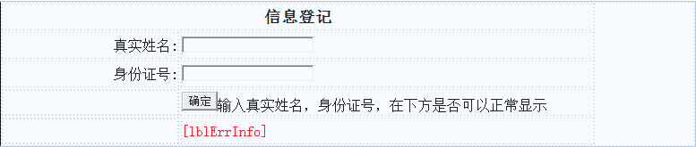

# 内置对象

本文主要学习Page，Request，Response，Session，Cookie，Application和Server对象。其中Page对象包括其

它对象。

## 一、Page对象

每一个aspx页面都对应一个页面类，它继承于System.Web.UI.Page类，Page对象就是此页面类的实例，即每一

个页面就是一个Page对象。

```
属性方法			 说明
IsPostBack			Bool值，指示该页面是否为响应客户端回发而加载，或其是否正被首次加载或访问
IsValid				Bool值，指示该页面验证是否成功
MasterPageFile		用于获取或设置母版页的文件名
```

IsValid在前面验证控件中已经使用过，MasterPageFile在后面的母版页中去学习，本章主要学习IsPostBack。

**有如下表单：**



**如下C#代码：**

```
protected void Page_Load(object sender, EventArgs e)
{       
    this.txtRealName.Text = "请输入真实姓名";
    this.txtCode.Text = "请输入身份证号";
}

#region 登录按钮
protected void btLogin_Click(object sender, EventArgs e)
{
    //此处无法正常显示用户的输入，因为点击确定按钮，会引起回发，页面重新加载，Page_Load里的代码会执行，两个文本框的值都重新赋值了，解决次问题使用IsPostBack判断即可
    this.lblErrInfo.Text = "您输入信息如下:<br/>真实姓名：" + this.txtRealName.Text + "<br/>身份证号:" + this.txtCode.Text;
}
#endregion
```

上述代码是无法实现，点击按钮，在下方显示姓名和身份证号码的。但是将Page_Load事件代码修改如下即可实

现功能。

```
protected void Page_Load(object sender, EventArgs e)
{
    if (!IsPostBack)
    {
        this.txtRealName.Text = "请输入真实姓名";
        this.txtCode.Text = "请输入身份证号";        
    }
}
```

## 二、Request对象

```
属性方法					 说明
Request.QueryString			取得Get请求中的数据
Request.Form				取得Post请求中的数据
Request						取得Post或Get请求中的数据
```

### （1）QueryString传值

制作游戏英雄图片列表，并使用QueryString传值实现点击列表弹出新网页展示英雄详细属性

**英雄图片列表效果：**


**影响详细介绍效果：**


**数据库：**

```
create table MyHero --英雄
(
	HeroId int primary key identity(1,1),  --编号
	HeroName varchar(50) not null,         --名字
	HeroPic varchar(100) not null,         --图片
	HeroSkill text,                        --技能介绍
	HeroEquipment text                     --出装介绍
)
select * from MyHero
insert into MyHero(HeroName,HeroPic,HeroSkill,HeroEquipment)
values('典韦','dianwei.jpg',
'主一副二，有大点大。团战中，典韦可尽量依靠自身超强的抗击打能力，冲向敌方后排，攻击后排脆皮输出。而敌方后排在全力攻击典韦时，己方也可以快速切入或是尽快解决掉敌方比较棘手的坦克英雄。',
'上单出装思路：这是典韦的坦克出装，如果对线的压力比较大，第一件装备就可以选择影忍之足，提高自己的抗压能力，红莲斗篷这件装备很适合典韦，尤其是被动效果，可以不错的帮助典韦快速推线，进而有充足的时间去游走GANK，方便可以快速叠加被动。不祥征兆与魔女斗篷是两件最常见的坦克出装，可以全面提升典韦的防御能力。 
典韦在游戏后期，比较害怕被射手英雄放风筝，因此可以选择反伤刺甲来针对射手英雄，也能减少自己受到的物理伤害。也可以选择破军，来配合大招的真实伤害，增加输出能力，看当时局势和阵容。 
最后一件霸者重装，能够最大化典韦的生命值，典韦可以为队伍吸收更多伤害。')

insert into MyHero(HeroName,HeroPic,HeroSkill,HeroEquipment)
values('夏侯敦','xiahoudun.jpg',
'主一副二，有大点大。夏侯惇的1技能豪气斩，必须要命中敌方英雄时，才能够触发第二段攻击，所以如何把握1技能的释放节奏尤为关键。',
'出装思路：在鞋子的选择上会更倾向于抵抗之靴，因为它更适用于团战，更少的被控制时间能够让夏侯惇更容易切入敌方后排。其他装备选择方面，不建议出输出，夏侯惇其实并不缺伤害，他主打的是技能的控制效果，红莲斗篷主要是提升夏侯惇的清线带线能力，方便其快速支援其他线上，而极寒风暴能在团战中发挥最大作用。魔女斗篷+不详征兆的抗性和血量足以支撑两个输出位对他的集火，站的越久输出越高。最后贤者的庇护提高双方和容错率，也可视阵容换成反伤甲或霸者重装。')

insert into MyHero(HeroName,HeroPic,HeroSkill,HeroEquipment)
values('刘邦','liubang.jpg',
'加点主1副2，有大点大。刘邦的被动是主要伤害手段，1技能需要掌握护盾的开启和引爆时机！2技能可限制对方输出及保护队友。大招则可以利用护盾就下危险中的队友并创造以多打少的机会。',
'出装思路：第一件鞋子，影刃还是抵抗，看对面阵容，一般影忍。第二件红莲斗篷，刘邦的核心防御装备，一技能的护盾伤害加上红莲斗篷献祭的效果，清兵推塔速度相当快。 
第三件冰痕之握，二技能命中后，刘邦的普通攻击能触发冰痕之握的效果，增强控制手段。也可以考虑极寒风暴，能对敌人造成减移速、减攻速和法术伤害，对需要粘人能力的刘邦来说非常合适。 
接下来两件装备可以根据敌方阵容进行调整，一般推荐不详+魔女竞价比很高，可替换为反伤甲、极寒风暴。 
最后一件推荐霸者重装堆血，顺风或需要41分推的话，可以出末世补充刘邦的输出伤害，同时10%的物理吸血，让刘邦在后期拥有更强的续航能力。')

insert into MyHero(HeroName,HeroPic,HeroSkill,HeroEquipment)
values('吕布','lvbu.jpg',
'主一副二，有大点大。吕布有较强的续航能力，能更持久地待在线上，也能更好地进行发育。大招标记范围是很大的，只比防御塔防御范围小一圈，敌方残血要躲在塔下猥琐防守，可随时从天而降直接收割！',
'上单出装思路：第一件装备鞋子，可以增加一技能命中率，第二件建议先出小背心（守护者之铠）后期再升级成不详，因为上单前期压力比较大，直接破军的话速度太慢，且容易被压爆。第三件破军，配合吕布的真实伤害残血收割。 
第四件闪电匕首，提升攻速，开团时大招跳后排，一技能命中接2下普攻，就能秒一个输出。 
最后两件魔女+复活甲，吕布跳入后排危险性还是比较大的，魔女和复活甲可以抵挡一定伤害提高容错率。当然大顺风收割局，想浪一点的话，可以去掉魔女出无尽。')

insert into MyHero(HeroName,HeroPic,HeroSkill,HeroEquipment)
values('项羽','xiangyu.jpg',
'加点主1副2，,技能搭配上，团战中用技能1突进和控制，并聚拢敌方英雄，然后搭配友方输出，使用技能2形成连续控制，而技能3则可以输出和收割。',
'上单出装思路：项羽以纯肉装为主，前期红莲斗篷、影忍之足为基础，保证线上的发育；
中期反伤刺甲、魔女斗篷，具备一定的法术抗性，进一步强化物理防御，返还敌军一定的物理伤害，克制敌方刺客，适合中期的小规模团战；
后期用霸者重装、不祥征兆补足，让项羽承受伤害的能力更高，还能够降低敌方的攻击速度和移动速度，间接性保护队友。')
```

**实体类：**

```
public class MyHeroEntity
{
    public int HeroId { get; set; }  //编号
    public string HeroName { get; set; } //名字
    public string HeroPic { get; set; } //图片
    public string HeroSkill { get; set; } //技能介绍
    public string HeroEquipment { get; set; } //出装介绍
}
```

**数据访问类（DBHelper参照第一章）：**

```
public class MyHeroDAL
{
    DBHelper db = new DBHelper();
	public MyHeroDAL()
	{
		//
		//TODO: 在此处添加构造函数逻辑
		//
    }

    #region 查询所有的英雄信息
    public List<MyHeroEntity> List()
    {
        string sql = "select * from MyHero";
        db.PrepareSql(sql);
        DataTable dt = new DataTable();
        dt = db.ExecQuery();
        List<MyHeroEntity> list = new List<MyHeroEntity>();
        foreach (DataRow dr in dt.Rows)
        {
            MyHeroEntity entity = new MyHeroEntity();
            entity.HeroId = int.Parse(dr["HeroId"].ToString());
            entity.HeroName = dr["HeroName"].ToString();
            entity.HeroPic = dr["HeroPic"].ToString();
            entity.HeroSkill = dr["HeroSkill"].ToString();
            entity.HeroEquipment = dr["HeroEquipment"].ToString();
            list.Add(entity);            
        }
        return list;
    }
    #endregion

    #region 查询一个英雄的详情
    public MyHeroEntity Detail(int heroId)
    {
        string sql = "select * from MyHero where HeroId = " + heroId;
        DataTable dt = new DataTable();
        db.PrepareSql(sql);
        dt = db.ExecQuery();
        if (dt.Rows.Count == 0)
            return null;
        else
        {
            MyHeroEntity entity = new MyHeroEntity();
            entity.HeroId = int.Parse(dt.Rows[0]["HeroId"].ToString());
            entity.HeroName = dt.Rows[0]["HeroName"].ToString();
            entity.HeroPic = dt.Rows[0]["HeroPic"].ToString();
            entity.HeroSkill = dt.Rows[0]["HeroSkill"].ToString();
            entity.HeroEquipment = dt.Rows[0]["HeroEquipment"].ToString();
            return entity;
        }
    }
    #endregion
}
```

**英雄图片列表页面：**

```
<h1>游戏英雄介绍</h1>
<form id="form1" runat="server">
<div>
    <% 
        MyHeroDAL dal = new MyHeroDAL();
        List<MyHeroEntity> list = new List<MyHeroEntity>();
        list = dal.List();
        foreach (MyHeroEntity item in list)
        {
        %>
        <div class="hero">
            " alt="" /><br/>
            <a href="Demo02_01.aspx?heroId=<%=item.HeroId %>" target="_blank"><%=item.HeroName %></a>
        </div>
        <%   
        }    
    %>
</div>
</form>
```

**英雄详情页面：**

```
<form id="form1" runat="server">
    <h1><asp:Label ID="lblName" runat="server"></asp:Label></h1>
    <div><asp:Image ID="imgHero" runat="server" /></div>
    <h2>技能介绍</h2>
    <div><asp:Label ID="lblSkill" runat="server"></asp:Label></div>
    <h2>出装介绍</h2>
    <div><asp:Label ID="lblEquipment" runat="server"></asp:Label></div>
</form>
```

**英雄详情C#代码：**

```
protected void Page_Load(object sender, EventArgs e)
{
    if (Request.QueryString["heroId"] == null || Request.QueryString["heroId"].ToString() == string.Empty)
    {
        return;
    }
    BindDetail();
}

#region 绑定数据到界面
private void BindDetail()
{
    MyHeroDAL dal = new MyHeroDAL();
    MyHeroEntity entity = new MyHeroEntity();
    entity = dal.Detail(int.Parse(Request.QueryString["heroId"]));
    this.lblName.Text = entity.HeroName;
    this.lblSkill.Text = entity.HeroSkill;
    this.lblEquipment.Text = entity.HeroEquipment;
    this.imgHero.ImageUrl = "img/" + entity.HeroPic;
}
#endregion
```

### （2）Form获取表单数据


**ASPX代码：**

```
<form id="form1" runat="server">
	<table width="1000" align="center">
		<caption>用户注册</caption>
		<tr>
			<td width="300" align="right" height="30">用户名:</td>
			<td width="700"><asp:TextBox ID="txtAccount" runat="server"></asp:TextBox>
			</td>
		</tr>
		<tr>
			<td width="300" align="right" height="30">密码:</td>
			<td width="700"><asp:TextBox ID="txtPwd" runat="server" TextMode="Password"></asp:TextBox>
			</td>
		</tr>
		<tr>
			<td width="300" align="right" height="30">密码确认:</td>
			<td width="700"><asp:TextBox ID="txtPwdOk" runat="server" TextMode="Password"></asp:TextBox>
			</td>
		</tr>
		<tr>
			<td width="300" align="right" height="30">邮箱:</td>
			<td width="700"><asp:TextBox ID="txtMail" runat="server"></asp:TextBox>
			</td>
		</tr>
		<tr>
			<td width="300" align="right" height="30">联系电话:</td>
			<td width="700"><asp:TextBox ID="txtPhone" runat="server"></asp:TextBox>
			</td>
		</tr>			
		<tr>
			<td width="300" align="right" height="30">性别:</td>
			<td width="700" align="left">
                <input type="radio" name="sex" value="男" checked="checked" />男
                <input type="radio" name="sex" value="女" />女
			</td>
		</tr>
		<tr>
			<td width="300" align="right" height="30">专业:</td>
			<td width="700">
				<asp:DropDownList ID="ddlProfessional" runat="server">
                    <asp:ListItem>请选择</asp:ListItem>
                    <asp:ListItem>软件开发</asp:ListItem>
                    <asp:ListItem>电子商务</asp:ListItem>
                    <asp:ListItem>国际贸易</asp:ListItem>
                    <asp:ListItem>工商管理</asp:ListItem>
                    <asp:ListItem>高级护理</asp:ListItem>
                </asp:DropDownList>
			</td>
		</tr>			
		<tr>
			<td width="300" align="right" height="30">爱好:</td>
			<td width="700" align="left">
                <input type="checkbox" name="hobby" value="抽烟" />抽烟
                <input type="checkbox" name="hobby" value="喝酒" />喝酒
                <input type="checkbox" name="hobby" value="嚼槟榔" />嚼槟榔
                <input type="checkbox" name="hobby" value="打游戏" />打游戏
                <input type="checkbox" name="hobby" value="烫头发" />烫头发
                <input type="checkbox" name="hobby" value="足球" />足球
			</td>
		</tr>
		<tr>
			<td width="300" align="right" height="30">头像:</td>
			<td width="700" align="left">
                <asp:FileUpload ID="filePhoto" runat="server" />
			</td>
		</tr>
		<tr>
			<td width="300" align="right" height="30">自我介绍:</td>
			<td width="700">
				<asp:TextBox ID="txtSelft" runat="server" Height="153px" TextMode="MultiLine" Width="427px"></asp:TextBox>
			</td>
		</tr>
		<tr>
			<td width="300" align="right" height="30">&nbsp;</td>
			<td width="700">
				<asp:Button ID="btReg" runat="server" Text="注册" 
                    onclick="btReg_Click" />
&nbsp;<input type="reset" value="取消" />
			</td>
		</tr>
	</table>
</form>
```

**C#代码：**

```
protected void btReg_Click(object sender, EventArgs e)
{
    string str = "您提交的信息如下: \\n\\n";
    str += "用户名:" + Request.Form["txtAccount"] + "\\n\\n";
    str += "密码:" + Request.Form["txtPwd"] + "\\n\\n";
    str += "邮箱:" + Request.Form["txtMail"] + "\\n\\n";
    str += "联系电话:" + Request.Form["txtPhone"] + "\\n\\n";
    str += "性别:" + Request.Form["sex"] + "\\n\\n";
    str += "专业:" + Request.Form["ddlProfessional"] + "\\n\\n";
    str += "爱好:" + Request.Form["hobby"] + "\\n\\n";
    if (Request.Files.Count > 0)
    {
        str += "头像:" + Request.Files[0].FileName + "\\n\\n";
    }
    str += "自我介绍:" + Request.Form["txtSelft"] + "\\n\\n";
    Page.ClientScript.RegisterStartupScript(this.GetType(), "js", "<script type='text/javascript'>alert('" + str + "');</script>");
}
```

### （3）Request属性

**ASPX代码：**

```
<form id="form1" runat="server">
    <div>
    	<asp:Label ID="lblInfo" runat="server"></asp:Label>
    </div>
</form>
```

**C#代码：**

```
protected void Page_Load(object sender, EventArgs e)
{
    if (!IsPostBack)
    {
        string str = "";
        str += "客户端主机所使用的语言:" + Request.UserLanguages[0] + "<br /><br />";
        str += "客户端主机的DNS名称:" + Request.UserHostName + "<br /><br />";
        str += "客户端主机的IP地址:" + Request.UserHostAddress + "<br /><br />";
        str += "客户端浏览器版本:" + Request.UserAgent + "<br /><br />";
        str += "当前要求的URL:" + Request.Url + "<br /><br />";
        str += "客户端网页的传送方式(Get/Post):" + Request.RequestType + "<br /><br />";
        str += "当前页面的URL:" + Request.RawUrl + "<br /><br />";
        str += "当前网页在服务器端的实际路径:" + Request.PhysicalPath + "<br /><br />";
        str += "目前联机的安全性:" + Request.IsSecureConnection + "<br /><br />";
        str += "目前联机是否有效:" + Request.IsAuthenticated + "<br /><br />";
        str += "客户端浏览器的字符设置:" + Request.ContentEncoding + "<br /><br />";
        str += "当前运行程序的服务器端虚拟目录:" + Request.ApplicationPath + "<br /><br />";
        this.lblInfo.Text = str;
    }
}
```

### （4）Request对象上传文件

如果使用 input type=file 标签，而不使用服务器端控件，则需要在form标签上添加 enctype="multipart/form-data"。

**ASPX代码：**

```
<form id="form1" runat="server">
<div>
    <asp:Image ID="myImg" runat="server" /> <br /><br />
    <asp:FileUpload ID="myFile" runat="server" />
    <asp:Button ID="btUpload" runat="server" Text="上传" onclick="btUpload_Click" />
    <br />	<br />
    <asp:Label ID="lblInfo" runat="server" ForeColor="#CC0000"></asp:Label>
</div>
</form>
```

**C#代码：**

```
#region 上传文件
protected void btUpload_Click(object sender, EventArgs e)
{
    HttpFileCollection files = Request.Files;
    HttpPostedFile postFile = files["myFile"];
    if (postFile == null || postFile.ContentLength == 0)
    {
        this.lblInfo.Text = "您没有选择文件或您上传的是空文件";
        return;
    }
    string[] arrFileName = postFile.FileName.Split('.');
    string fileFix = arrFileName[arrFileName.Length - 1].ToLower();
    if (!fileFix.Equals("jpg") && !fileFix.Equals("jpeg") && !fileFix.Equals("png") && !fileFix.Equals("gif"))
    {
        this.lblInfo.Text = "文件格式不正确!";
        return;
    }
    DateTime now = DateTime.Now;
    string myFileName = now.ToString("yyyyMMddHHmmss") + now.Millisecond + "." + fileFix;
    postFile.SaveAs(Server.MapPath(".") + "/uploadfile/" + myFileName);
    this.myImg.Width = 300;
    this.myImg.Height = 100;
    this.myImg.ImageUrl = "uploadfile/" + myFileName;
    this.lblInfo.Text = myFileName;
}
#endregion
```

## 三、Response对象

Response对象用于将数据从服务器发送回浏览器。

```
属性方法								说明
Cookies								   获取响应的Cookie集合
Redirect							   将客户端重定向到新的URL
Write								   将信息写入HTTP响应输入流
```

```
#region 打印文本信息
protected void bt1_Click(object sender, EventArgs e)
{
	Response.Write("ASP.NET,你好！");
}
#endregion
```

    #region 输入JS代码
    protected void bt2_Click(object sender, EventArgs e)
    {
    	Response.Write("<script type='text/javascript'>alert('ASP.NET,你好!');</script>");
    }
    #endregion
```
#region 页面重定向
protected void bt3_Click(object sender, EventArgs e)
{
	Response.Redirect("Demo04_01.aspx");
}
#endregion
```

```
#region 结束输出
protected void bt4_Click(object sender, EventArgs e)
{
    Response.Write("我是在Response.End()之前的文本内容！");
    Response.End();
    Response.Write("我是在Response.End()之后的文本内容！");
}
#endregion
```

```
#region 输出文件中的内容
protected void bt5_Click(object sender, EventArgs e)
{
	Response.WriteFile("readme.txt");
}
#endregion
```

```
#region 大数据输出
protected void bt6_Click(object sender, EventArgs e)
{
    int i = 1;
    while (true)
    {
        Response.Write("ASP.NET,你好！");
        i++;
        if (i == 1000)
        {
            Response.Flush();  //强制输出内容，强制回发给客户端
            Response.Clear(); //清除缓冲区内容
            i = 1;
        }        
    }
}
#endregion
```

## 四、Session对象

Session对象用于存储在多个页面之间传递的特定用户的信息。

Session是服务端数据，其储存于服务端。

针对每个浏览器的连接，系统会建立单独的会话，并自动分配一个SessionID来标识。

**使用场景：**

一般网站的登录信息可以用Session存储，在多个页面中共享。

部分网站购物车也可能是使用Session来制作的。

### （1）Session保存登录信息

**登录页面：**


**登录之后的多个页面记录用户信息（页面一）：**


**登录之后的多个页面记录用户信息（页面二）：**


**数据库代码：**

```
create table MyUser --用户
(
	UserId int primary key identity(1,1), --用户编号
	UserAccount varchar(50) not null,  --账号
	UserPwd varchar(50) not null,  --密码
	UserMail varchar(100) not null, --邮箱
	UserPhone varchar(20) not null, --电话
	UserSex varchar(2) not null,    --性别
)
insert into MyUser(UserAccount,UserPwd,UserMail,UserPhone,UserSex)
values('liubei','123456','liubei@qq.com','13547896547','男')
insert into MyUser(UserAccount,UserPwd,UserMail,UserPhone,UserSex)
values('guanyu','123456','guanyu@qq.com','15356875478','男')
insert into MyUser(UserAccount,UserPwd,UserMail,UserPhone,UserSex)
values('zhangfei','123456','zhangfei@qq.com','13666689874','男')
```

**实体类：**

```
public class MyUserEntity
{
    public int UserId { get; set; }
    public string UserAccount { get; set; }
    public string UserPwd { get; set; }
    public string UserMail { get; set; }
    public string UserPhone { get; set; }
    public string UserSex { get; set; }
}
```

**数据访问代码（DBHelper参照第一章）：**

```
public class MyUserDAL
{
    DBHelper db = new DBHelper();
	public MyUserDAL()
	{
		//
		//TODO: 在此处添加构造函数逻辑
		//
	}

    #region 用户登录
    /// <summary>
    /// 用户登录
    /// </summary>
    /// <param name="strAcc">用户名</param>
    /// <param name="strPwd">密码</param>
    /// <returns>布尔值,登录成功返回用户ID,登录失败返回0</returns>
    public MyUserEntity Login(string strAcc, string strPwd)
    {
        string sql = "select * from MyUser where UserAccount=@UserAccount and UserPwd=@UserPwd";
        db.PrepareSql(sql);
        db.SetParameter("UserAccount", strAcc);
        db.SetParameter("UserPwd", strPwd);
        DataTable dt = new DataTable();
        dt = db.ExecQuery();
        if (dt.Rows.Count == 1)
        {
            MyUserEntity entity = new MyUserEntity();
            entity.UserId = int.Parse(dt.Rows[0]["UserId"].ToString());
            entity.UserAccount = dt.Rows[0]["UserAccount"].ToString();
            entity.UserPwd = dt.Rows[0]["UserPwd"].ToString();
            entity.UserMail = dt.Rows[0]["UserMail"].ToString();
            entity.UserPhone = dt.Rows[0]["UserPhone"].ToString();
            entity.UserSex = dt.Rows[0]["UserSex"].ToString();
            return entity;
        }
        else
        {
            return null;
        }
    }
    #endregion

    #region 根据用户ID查询用户信息
    public MyUserEntity Detail(int userId)
    {
        string sql = "select * from MyUser where UserId = @UserId";
        DataTable dt = new DataTable();
        db.PrepareSql(sql);
        db.SetParameter("UserId", userId);
        dt = db.ExecQuery();
        if (dt.Rows.Count == 0)
            return null;
        MyUserEntity entity = new MyUserEntity();
        entity.UserId = int.Parse(dt.Rows[0]["UserId"].ToString());
        entity.UserAccount = dt.Rows[0]["UserAccount"].ToString();
        entity.UserPwd = dt.Rows[0]["UserPwd"].ToString();
        entity.UserMail = dt.Rows[0]["UserMail"].ToString();
        entity.UserPhone = dt.Rows[0]["UserPhone"].ToString();
        entity.UserSex = dt.Rows[0]["UserSex"].ToString();
        return entity;  
    }
    #endregion
}
```

登录页面ASPX代码：

```
<html xmlns="http://www.w3.org/1999/xhtml">
<head runat="server">
    <title>Session的应用</title>
    <style type="text/css">
        #container{ text-align:center;}
        .righttd
        {
            width: 460px;
        }
        .lefted
        {
            width: 196px;
        }
        .mytitle{ font-size:18px; font-weight:bold;}
    </style>
</head>
<body>
    <form id="form1" runat="server">
    <div id="container">
        <table>
            <tr>
                <td align="center" height="30" class="mytitle" colspan="2">用户登录</td>
            </tr>
            <tr>
                <td align="right" class="lefted" height="30">用户名:</td>
                <td align="left" class="righttd" height="30">
                    <asp:TextBox ID="txtAccount" runat="server"></asp:TextBox>
                </td>
            </tr>
            <tr>
                <td align="right" class="lefted" height="30">密码:</td>
                <td align="left" class="righttd" height="30">
                    <asp:TextBox ID="txtPwd" runat="server" TextMode="Password"></asp:TextBox>
                </td>
            </tr>
            <tr>
                <td align="right" class="lefted" height="30"></td>
                <td align="left" class="righttd" height="30">
                    <asp:Button ID="btLogin" runat="server" onclick="btLogin_Click" Text="登  录" />
                </td>
            </tr>
            <tr>
                <td align="right" class="lefted" height="30"></td>
                <td align="left" class="righttd" height="30">
                    <asp:Label ID="lblErrInfo" runat="server" ForeColor="Red"></asp:Label>
                </td>
            </tr>
        </table>
    </div>
    </form>
</body>
</html>
```

**登录页面C#代码：**

```
public partial class Demo05 : System.Web.UI.Page
{
    protected void Page_Load(object sender, EventArgs e)
    {

    }

    #region 登录
    protected void btLogin_Click(object sender, EventArgs e)
    {
        MyUserDAL dal = new MyUserDAL();
        MyUserEntity entity = new MyUserEntity();
        entity = dal.Login(this.txtAccount.Text.Trim(), this.txtPwd.Text.Trim());
        if (entity != null)
        {
            //此处可以将用户名或这ID保存到Session，其他页面需要其他信息的时候在从数据库查询出来
            //也可以将整个用户对象保存到Session中
            Session["User"] = entity;
            Session.Timeout = 30;       //Session过期时间为30分钟
            Response.Redirect("Demo05_01.aspx");
        }
        else
        {
            this.lblErrInfo.Text = "登录失败：用户名或密码错误!";
            return;
        }
    }
    #endregion
}
```

网站其它页面展示登录信息ASPX代码：

```
<h1>欢迎来到*****系统,登录用户信息如下</h1>
<asp:Label ID="lblUserInfo" runat="server"></asp:Label>
```

网站其它页面展示登录信息C#代码：

```
public partial class Demo05_01 : System.Web.UI.Page
{
    protected void Page_Load(object sender, EventArgs e)
    {
        string info = "";
        if (Session["User"] != null)
        {
            MyUserEntity entity = (MyUserEntity)Session["User"];
            info += "SessionID:" + Session.SessionID + "<br /><br />";
            info += "用户ID:" + entity.UserId.ToString() + "<br /><br />";
            info += "用户名:" + entity.UserAccount + "<br /><br />";
            info += "密码：" + entity.UserPwd + "<br /><br />";
            info += "邮箱：" + entity.UserMail + "<br /><br />";
            info += "电话：" + entity.UserPhone + "<br /><br />";
            info += "性别：" + entity.UserSex + "<br /><br />";
            this.lblUserInfo.Text = info;
        }
        else
        {
            this.lblUserInfo.Text = "您还没有登录!";
        }
    }
}
```

### （2）Session购物车

**数据库代码：**

```
create table MyMilk --奶粉
(
	MilkId int primary key identity(1,1),
	MilkTitle nvarchar(100), --奶粉标题
	MilkPic nvarchar(100), --奶粉图片
	MilkPrice decimal(10,2), --奶粉价格
	MilkWeight int --奶粉重量（克）
)
insert into MyMilk(MilkTitle,MilkPic,MilkPrice,MilkWeight)
values('美素力金装','1.jpg','229','900')
insert into MyMilk(MilkTitle,MilkPic,MilkPrice,MilkWeight)
values('惠氏启赋','2.jpg','210','900')
insert into MyMilk(MilkTitle,MilkPic,MilkPrice,MilkWeight)
values('爱他美婴儿配方','3.jpg','378','900')
insert into MyMilk(MilkTitle,MilkPic,MilkPrice,MilkWeight)
values('美赞臣A+','4.jpg','350','900')
insert into MyMilk(MilkTitle,MilkPic,MilkPrice,MilkWeight)
values('美赞臣婴儿配方','5.jpg','268','900')
insert into MyMilk(MilkTitle,MilkPic,MilkPrice,MilkWeight)
values('诺优能婴儿配方','6.jpg','278','900')
insert into MyMilk(MilkTitle,MilkPic,MilkPrice,MilkWeight)
values('飞鹤星飞帆','7.jpg','209','900')
insert into MyMilk(MilkTitle,MilkPic,MilkPrice,MilkWeight)
values('合生元超级呵护','8.jpg','315','900')
insert into MyMilk(MilkTitle,MilkPic,MilkPrice,MilkWeight)
values('合生元阿尔法星','9.jpg','339','900')
insert into MyMilk(MilkTitle,MilkPic,MilkPrice,MilkWeight)
values('美素婴幼儿','10.jpg','318','900')
insert into MyMilk(MilkTitle,MilkPic,MilkPrice,MilkWeight)
values('雅培亲体金装','11.jpg','210','900')
insert into MyMilk(MilkTitle,MilkPic,MilkPrice,MilkWeight)
values('开心羊金装','12.jpg','205','900')
```

**实体类：**

```
public class MyMilkEntity
{
    public int MilkId { get; set; } //编号
    public string MilkTitle { get; set; } //名称标题
    public string MilkPic { get; set; } //图片
    public double MilkPrice { get; set; } //价格
    public int MilkWeight { get; set; } //重量
}
```

**数据访问代码（DBHelper参考第一章）：**

```
public class MyMilkDAL
{
    DBHelper db = new DBHelper();
    #region 查询所有的奶粉
    public List<MyMilkEntity> List()
    {
        string sql = "select * from MyMilk";
        db.PrepareSql(sql);
        DataTable dt = new DataTable();
        dt = db.ExecQuery();
        List<MyMilkEntity> list = new List<MyMilkEntity>();
        foreach (DataRow dr in dt.Rows)
        {
            MyMilkEntity entity = new MyMilkEntity();
            entity.MilkId = int.Parse(dr["MilkId"].ToString());
            entity.MilkTitle = dr["MilkTitle"].ToString();
            entity.MilkPic = dr["MilkPic"].ToString();
            entity.MilkPrice = double.Parse(dr["MilkPrice"].ToString());
            entity.MilkWeight = int.Parse(dr["MilkWeight"].ToString());
            list.Add(entity);
        }
        return list;
    }
    #endregion

    #region 查询一个奶粉的详情
    public MyMilkEntity Detail(int milkId)
    {
        string sql = "select * from MyMilk where MilkId = " + milkId;
        DataTable dt = new DataTable();
        db.PrepareSql(sql);
        dt = db.ExecQuery();
        if (dt.Rows.Count == 0)
            return null;
        else
        {
            MyMilkEntity entity = new MyMilkEntity();
            entity.MilkId = int.Parse(dt.Rows[0]["MilkId"].ToString());
            entity.MilkTitle = dt.Rows[0]["MilkTitle"].ToString();
            entity.MilkPic = dt.Rows[0]["MilkPic"].ToString();
            entity.MilkPrice = double.Parse(dt.Rows[0]["MilkPrice"].ToString());
            entity.MilkWeight = int.Parse(dt.Rows[0]["MilkWeight"].ToString());
            return entity;
        }
    }
    #endregion
}
```

**商品列表代码：**

```
<html xmlns="http://www.w3.org/1999/xhtml">
<head runat="server">
    <title>Session购物车</title>
    <style type="text/css"> 
        div,ul,li{ margin:0px; padding:0px;}
        .milk{ width:220px; float:left; line-height:30px; text-align:center; border:solid 1px gray; margin:10px; padding:10px;}
        .milk a{ text-decoration:none;}
        .milkImg{ width:220px; text-align:center; clear:both;}
        .milkTitle{ width:220px; text-align:center; clear:both;}
        .priceAndCart{ clear:both;}
        .price{ width:100px; float:left; color:Red;}
        .cart{ width:100px; float:right}
        .cart a{ display:block; height:30px; line-height:30px; text-decoration:none; background-color:Red; color:White;}
        .hero img{ width:150px; height:200px;}
    </style>
</head>
<body>
    <h1>京东  <a href="Demo06_Cart.aspx">我的购物车</a></h1>
    <form id="form1" runat="server">
    <div>
        <% 
            MyMilkDAL dal = new MyMilkDAL();
            List<MyMilkEntity> list = new List<MyMilkEntity>();
            list = dal.List();
            foreach (MyMilkEntity item in list)
            {
         %>
            <div class="milk">
                <div class="milkImg"><a href="Demo06_01.aspx?MilkId=<%=item.MilkId %>" target="_blank">" alt="MilkPic" /></a></div>
                <div class="milkTitle"><a href="Demo06_01.aspx?MilkId=<%=item.MilkId %>" target="_blank"><%=item.MilkTitle %></a></div>
                <div class="priceAndCart">
                    <div class="price">价格：<%=item.MilkPrice %></div>
                    <div class="cart"><a href="Demo06_AddCart.aspx?MilkId=<%=item.MilkId %>">加入购物车</a></div>
                </div>
            </div>
         <%   
            }    
        %>
    </div>

    </form>
</body>
</html>
```

**商品详情代码：**

```
<html xmlns="http://www.w3.org/1999/xhtml">
<head runat="server">
    <title>Session购物车</title>
    <style type="text/css">
        #divImg{ width:250px; float:left;}
        #divBasic{ width:740px; float:left; padding:20px;}
        #divBasic div{ line-height:30px;}
        #cart a{ display:block; width:30px; height:30px; float:left; background-color:Gray; text-align:center; 
                  text-decoration:none; color:White; line-height:30px;}
        #cart input{ display:block; width:30px; height:24px; float:left; text-align:center;}
        #cart #addCart{display:block; margin-left:20px; width:100px; height:30px; line-height:30px; text-decoration:none; background-color:Red; color:White;}
    </style>
    <script src="js/jquery.js" type="text/javascript"></script>
    <script type="text/javascript">
        $(function () {
            $("#a1").click(function () {
                if (isNaN($("#count").val())) {
                    $("#count").val("1");
                    return;
                }
                var count = parseInt($("#count").val()) - 1;
                if (count < 1)
                    return;
                $("#count").val(count);
            })
            $("#a2").click(function () {
                if (isNaN($("#count").val())) {
                    $("#count").val("1");
                    return;
                }
                var count = parseInt($("#count").val()) + 1;
                $("#count").val(count);
            })
            $("#addCart").click(function () {
                $("#form1").submit();
            })

        })        
    </script>
</head>
<body>
    <form id="form1" runat="server" action="Demo06_AddCart.aspx">
    <div style=" width:1100px; margin:20px auto;">
        <div>
            <div id="divImg"><asp:Image ID="imgMilk" runat="server" Width="250" Height="300" /></div>
            <div id="divBasic">
                <asp:HiddenField ID="MilkId" runat="server" />
                <div>名称：<asp:Label ID="lblTitle" runat="server"></asp:Label></div>
                <div>价格：<asp:Label ID="lblPrice" runat="server"></asp:Label></div>
                <div>重量：<asp:Label ID="lblWeight" runat="server"></asp:Label></div>
                <div id="cart">
                <a id="a1" href="javascript:void(0);">-</a>
                <asp:TextBox ID="count" runat="server" Text="1"></asp:TextBox>
                <a id="a2" href="javascript:void(0);">+</a>
                <a id="addCart" href="javascript:void(0);">加入购物车</a>
                </div>
            </div>
        </div>
        <div style=" clear:both;">
            <h2>产品详情</h2>
            <hr />
            略。。。
        </div>
    </div>
    </form>
</body>
</html>
```

```
public partial class Demo06_01 : System.Web.UI.Page
{
    protected void Page_Load(object sender, EventArgs e)
    {
        if (Request.QueryString["MilkId"] == null || Request.QueryString["MilkId"].ToString() == string.Empty)
            return;
        if (!IsPostBack)
        {
            BindDetail();
        }
    }

    #region 绑定产品详情
    private void BindDetail()
    {
        int MilkId = int.Parse(Request.QueryString["MilkId"].ToString());
        MyMilkDAL dal = new MyMilkDAL();
        MyMilkEntity entity = new MyMilkEntity();
        entity = dal.Detail(MilkId);
        this.MilkId.Value = entity.MilkId.ToString();
        this.imgMilk.ImageUrl = "img/" + entity.MilkPic;
        this.lblTitle.Text = entity.MilkTitle;
        this.lblPrice.Text = "¥:" + entity.MilkPrice.ToString();
        this.lblWeight.Text = entity.MilkWeight + "克";
    }
    #endregion
}
```

**添加至购物车代码：**

```
<html xmlns="http://www.w3.org/1999/xhtml">
<head runat="server">
    <title>Session购物车</title>
    <style type="text/css">
        .lefttd{ width:200px;}
        .centertd{ width:600px;}
        .righttd{ width:300px;}
        .righttd a{ display:block; width:120px; margin:5px; background-color:Red; text-decoration:none; color:White;
                     height:30px; line-height:30px; float:left; text-align:center;}
    </style>
</head>
<body>
    <h1 style=" color:Green;">商品已经成功添加至购物车</h1>
    <form id="form1" runat="server">
    <table width="1100" border="0">
        <tr >
            <td class="lefttd"><asp:Image ID="imgMilk" runat="server" /></td>
            <td class="centertd">
                <asp:Label ID="lblTitle" runat="server" ></asp:Label><br />
                <asp:Label ID="lblInfo" runat="server" ></asp:Label><br />
            </td>
            <td class="righttd">
            <a href="Demo06_01.aspx?MilkId=<%=Request["MilkId"] %>">查看商品详情</a>
            <a href="Demo06_Cart.aspx">去购物车结算</a>
            </td>
        </tr>
    </table>
    </form>
</body>
</html>
```

```
public partial class Demo06_AddCart : System.Web.UI.Page
{
    protected void Page_Load(object sender, EventArgs e)
    {
        if (Request["MilkId"] == null || Request["MilkId"] == string.Empty)
        {
            Response.Redirect("Demo06.aspx");
            return;
        }
        if (!IsPostBack)
        {
            BindDetail();
            SetSession();
        }

    }

    #region 绑定产品详情
    private void BindDetail()
    {
        int MilkId = int.Parse(Request["MilkId"].ToString());
        MyMilkDAL dal = new MyMilkDAL();
        MyMilkEntity entity = new MyMilkEntity();
        entity = dal.Detail(MilkId);
        this.imgMilk.ImageUrl = "img/" + entity.MilkPic;
        this.lblTitle.Text = entity.MilkTitle;
        int count = 1;
        if (Request["count"] != null && Request["count"] != string.Empty)
            count = int.Parse(Request["count"]);
        this.lblInfo.Text = "价格：¥" + entity.MilkPrice + "//订单数量:" + count;
    }
    #endregion

    #region 存储商品信息到Session
    private void SetSession()
    {
        int MilkId = int.Parse(Request["MilkId"].ToString());
        List<MyCartEntity> list;
        if (Session["cart"] == null)
        {
            list = new List<MyCartEntity>();
        }
        else
        {
            list = (List<MyCartEntity>)Session["cart"];
        }
        int count = 1;
        if (Request["count"] != null && Request["count"] != string.Empty)
            count = int.Parse(Request["count"]);

        //循环list，如果找到相同商品，则数量相加
        bool isFindSame = false; //默认找不到相同的商品
        for (int i = 0; i <= list.Count - 1; i++)
        {
            if (list[i].MilkId == MilkId)
            {
                list[i].Count += count;
                isFindSame = true;
            }
        }

        //没有找到相同商品则直接添加该商品记录
        if (isFindSame == false)
        {
            MyCartEntity cartEntity = new MyCartEntity();
            cartEntity.MilkId = MilkId;
            cartEntity.Count = count;
            list.Add(cartEntity);
        }

        Session["cart"] = list;
    }
    #endregion
}
```

**购物车查看代码：**

```
<html xmlns="http://www.w3.org/1999/xhtml">
<head runat="server">
    <title>Session购物车</title>
    <style type="text/css">
        #a1,#a2{ display:block; width:30px; height:30px; float:left; background-color:Gray; text-align:center; 
                  text-decoration:none; color:White; line-height:30px;}
        #count{ display:block; width:30px; height:24px; float:left; text-align:center;}
    </style>
</head>
<body>
    <h1>我的购物车</h1>
    <form id="form1" runat="server">
    <table width="1100" border="0">
        <tr style=" background-color:Gray;">
            <td width="200">图片</td>
            <td width="400">名称</td>
            <td width="100">单价</td>
            <td width="200">数量</td>
            <td width="100">小计</td>
            <td width="100">操作</td>
        </tr>
    <% 
        if (Session["cart"] == null)
        {
            Response.Write("<h1>购物车中没有商品</h1>");
            Response.End();
            return; 
        }
        MyMilkDAL dal = new MyMilkDAL();
        List<MyCartEntity> list = new List<MyCartEntity>();
        list = (List<MyCartEntity>)Session["cart"];
        double sumMoney = 0;
        foreach (MyCartEntity item in list)
        {
            MyMilkEntity milkEntity = new MyMilkEntity();
            milkEntity = dal.Detail(item.MilkId);
    %>
        <tr>
            <td width="200" style=" height:180px;">" width="100" height="140" alt="" /></td>
            <td width="400"><%=milkEntity.MilkTitle%></td>
            <td width="100">¥<%=milkEntity.MilkPrice%></td>
            <td width="200">
                <a id="a1" href="Demo06_Cart.aspx?type=1&MilkId=<%=item.MilkId %>">-</a>
                <input type="text" value="<%=item.Count %>" id="count" />
                <a id="a2" href="Demo06_Cart.aspx?type=2&MilkId=<%=item.MilkId %>">+</a>
            </td>
            <td width="100"><%=milkEntity.MilkPrice * item.Count%></td>
            <td width="100"><a href="Demo06_Cart.aspx?type=delete&MilkId=<%=item.MilkId %>">删除</a></td>
        </tr>
    <%   
        sumMoney += milkEntity.MilkPrice * item.Count;
        }
    %>

    </table>
    <div style="  font-size:20px;  color:Red; font-weight:bold;">
            <div style="width:100px; float:left; height:30px; line-height:40px; ">总计:<%=sumMoney%></div>
            <a href="#" style="display:block; width:120px; margin:5px; background-color:Red; text-decoration:none; color:White;
                     height:30px; line-height:30px; float:left; text-align:center;">去结算</a>
    </div>
    </form>
</body>
</html>
```

```
public partial class Demo06_Cart : System.Web.UI.Page
{
    protected void Page_Load(object sender, EventArgs e)
    {
        if (Session["cart"] == null)
        {
            Response.Write("<h1>购物车中没有商品</h1>");
            Response.End();
            return;
        }

        if (!IsPostBack)
        {
            if (Request["type"] == null)
                return;
            if (Request["type"].Equals("1")) //数量-1
                ReduceOne();
            if (Request["type"].Equals("2")) //数量+1
                AddOne();
            if (Request["type"].Equals("delete")) //删除商品 
                DeleteCart();
        }
        Response.Redirect("Demo06_Cart.aspx");
    }

    private void AddOne()
    {
        List<MyCartEntity> list = new List<MyCartEntity>();
        list = (List<MyCartEntity>)Session["cart"];
        for (int i = 0; i <= list.Count - 1; i++)
        {
            if (list[i].MilkId == int.Parse(Request["MilkId"]))
            {
                list[i].Count++;
            }
        }
        Session["cart"] = list;
    }

    private void ReduceOne()
    {
        List<MyCartEntity> list = new List<MyCartEntity>();
        list = (List<MyCartEntity>)Session["cart"];
        for (int i = 0; i <= list.Count - 1; i++)
        {
            if (list[i].MilkId == int.Parse(Request["MilkId"]) && list[i].Count > 1)
            {
                list[i].Count--;
            }
        }
        Session["cart"] = list;
    }

    private void DeleteCart()
    {
        List<MyCartEntity> list = new List<MyCartEntity>();
        list = (List<MyCartEntity>)Session["cart"];
        for (int i = 0; i <= list.Count - 1; i++)
        {
            if (list[i].MilkId == int.Parse(Request["MilkId"]))
            {
                list.RemoveAt(i);
                break;
            }
        }
        Session["cart"] = list;
    }
}
```

## 五、Cookie对象

Cookie用于在客户端浏览器中存储少量信息，通常存放非敏感的用户信息，保存的时间可以根据用户的需要进行

设置。

并非所有的浏览器都支持Cookie，数据信息是以文本的形式保存在客户端，不占用服务端资源。

由于Cookie是保存在客户端的文本文件，为确保其安全性，一般不要将敏感的信息保存在Cookie中，如用户密码

等。

如果没有设定Cookie的过期时间，则Cookie的生命周期仅保持到关闭浏览器为止。

如果将过期时间设定为MaxValue，则Cookie永不过期。

Cookie的大小限制为4KB ，所以Cookie中不能存储大量数据。

**Cookie保存用户登录信息：**

**数据库代码：**

```
create table MyUser --用户
(
	UserId int primary key identity(1,1), --用户编号
	UserAccount varchar(50) not null,  --账号
	UserPwd varchar(50) not null,  --密码
	UserMail varchar(100) not null, --邮箱
	UserPhone varchar(20) not null, --电话
	UserSex varchar(2) not null,    --性别
)
insert into MyUser(UserAccount,UserPwd,UserMail,UserPhone,UserSex)
values('liubei','123456','liubei@qq.com','13547896547','男')
insert into MyUser(UserAccount,UserPwd,UserMail,UserPhone,UserSex)
values('guanyu','123456','guanyu@qq.com','15356875478','男')
insert into MyUser(UserAccount,UserPwd,UserMail,UserPhone,UserSex)
values('zhangfei','123456','zhangfei@qq.com','13666689874','男')
```

**实体类：**

```
public class MyUserEntity
{
    public int UserId { get; set; }
    public string UserAccount { get; set; }
    public string UserPwd { get; set; }
    public string UserMail { get; set; }
    public string UserPhone { get; set; }
    public string UserSex { get; set; }
}
```

**数据访问代码（DBHelper参照第一章）：**

```
public class MyUserDAL
{
    DBHelper db = new DBHelper();
	public MyUserDAL()
	{
		//
		//TODO: 在此处添加构造函数逻辑
		//
	}

    #region 用户登录
    /// <summary>
    /// 用户登录
    /// </summary>
    /// <param name="strAcc">用户名</param>
    /// <param name="strPwd">密码</param>
    /// <returns>布尔值,登录成功返回用户ID,登录失败返回0</returns>
    public MyUserEntity Login(string strAcc, string strPwd)
    {
        string sql = "select * from MyUser where UserAccount=@UserAccount and UserPwd=@UserPwd";
        db.PrepareSql(sql);
        db.SetParameter("UserAccount", strAcc);
        db.SetParameter("UserPwd", strPwd);
        DataTable dt = new DataTable();
        dt = db.ExecQuery();
        if (dt.Rows.Count == 1)
        {
            MyUserEntity entity = new MyUserEntity();
            entity.UserId = int.Parse(dt.Rows[0]["UserId"].ToString());
            entity.UserAccount = dt.Rows[0]["UserAccount"].ToString();
            entity.UserPwd = dt.Rows[0]["UserPwd"].ToString();
            entity.UserMail = dt.Rows[0]["UserMail"].ToString();
            entity.UserPhone = dt.Rows[0]["UserPhone"].ToString();
            entity.UserSex = dt.Rows[0]["UserSex"].ToString();
            return entity;
        }
        else
        {
            return null;
        }
    }
    #endregion

    #region 根据用户ID查询用户信息
    public MyUserEntity Detail(int userId)
    {
        string sql = "select * from MyUser where UserId = @UserId";
        DataTable dt = new DataTable();
        db.PrepareSql(sql);
        db.SetParameter("UserId", userId);
        dt = db.ExecQuery();
        if (dt.Rows.Count == 0)
            return null;
        MyUserEntity entity = new MyUserEntity();
        entity.UserId = int.Parse(dt.Rows[0]["UserId"].ToString());
        entity.UserAccount = dt.Rows[0]["UserAccount"].ToString();
        entity.UserPwd = dt.Rows[0]["UserPwd"].ToString();
        entity.UserMail = dt.Rows[0]["UserMail"].ToString();
        entity.UserPhone = dt.Rows[0]["UserPhone"].ToString();
        entity.UserSex = dt.Rows[0]["UserSex"].ToString();
        return entity;  
    }
    #endregion
}
```

**登录页面ASPX代码：**

```
<html xmlns="http://www.w3.org/1999/xhtml">
<head runat="server">
    <title>Cookie的应用</title>
    <style type="text/css">
        #container{ text-align:center;}
        .righttd
        {
            width: 460px;
        }
        .lefted
        {
            width: 196px;
        }
        .mytitle{ font-size:18px; font-weight:bold;}
    </style>
</head>
<body>
    <form id="form1" runat="server">
    <div id="container">
        <table>
            <tr>
                <td align="center" height="30" class="mytitle" colspan="2">用户登录</td>
            </tr>
            <tr>
                <td align="right" class="lefted" height="30">用户名:</td>
                <td align="left" class="righttd" height="30">
                    <asp:TextBox ID="txtAccount" runat="server"></asp:TextBox>
                </td>
            </tr>
            <tr>
                <td align="right" class="lefted" height="30">密码:</td>
                <td align="left" class="righttd" height="30">
                    <asp:TextBox ID="txtPwd" runat="server" TextMode="Password"></asp:TextBox>
                </td>
            </tr>
            <tr>
                <td align="right" class="lefted" height="30"></td>
                <td align="left" class="righttd" height="30">
                    <asp:Button ID="btLogin" runat="server" onclick="btLogin_Click" Text="登  录" />
                </td>
            </tr>
            <tr>
                <td align="right" class="lefted" height="30"></td>
                <td align="left" class="righttd" height="30">
                    <asp:Label ID="lblErrInfo" runat="server" ForeColor="Red"></asp:Label>
                </td>
            </tr>
        </table>
    </div>
    </form>
</body>
</html>
```

**登录页面C#代码：**

```
public partial class Demo07 : System.Web.UI.Page
{
    protected void Page_Load(object sender, EventArgs e)
    {

    }

    protected void btLogin_Click(object sender, EventArgs e)
    {
        MyUserDAL dal = new MyUserDAL();
        MyUserEntity entity = new MyUserEntity();
        entity = dal.Login(this.txtAccount.Text.Trim(), this.txtPwd.Text.Trim());
        if (entity != null)
        {
            HttpCookie UserId = new HttpCookie("UserId",entity.UserId.ToString());
            UserId.Expires = System.DateTime.Now.AddDays(1);
            Response.Cookies.Add(UserId);
            Response.Redirect("Demo07_01.aspx");
        }
        else
        {
            this.lblErrInfo.Text = "登录失败：用户名或密码错误!";
            return;
        }
    }
}
```

**其它页面读取Cookie信息：**

```
<h1>欢迎来到*****系统,登录用户信息如下</h1>
<asp:Label ID="lblUserInfo" runat="server"></asp:Label>   
```

```
public partial class Demo07_01 : System.Web.UI.Page
{
    protected void Page_Load(object sender, EventArgs e)
    {
        if (Request.Cookies["UserId"] == null || Request.Cookies["UserId"].Value == string.Empty)
        {
            this.lblUserInfo.Text = "你还没有登录！";
            return;
        }
        if (!IsPostBack)
        {
            string info = "";
            MyUserDAL dal = new MyUserDAL();
            MyUserEntity entity = new MyUserEntity() ;
            entity = dal.Detail(int.Parse(Request.Cookies["UserId"].Value));
            info += "用户ID:" + entity.UserId.ToString() + "<br /><br />";
            info += "用户名:" + entity.UserAccount + "<br /><br />";
            info += "密码：" + entity.UserPwd + "<br /><br />";
            info += "邮箱：" + entity.UserMail + "<br /><br />";
            info += "电话：" + entity.UserPhone + "<br /><br />";
            info += "性别：" + entity.UserSex + "<br /><br />";
            this.lblUserInfo.Text = info;
        }
    }
}
```

## 六、Application应用

Application对象用于共享应用程序级信息，即多个用户共享一个Application对象。

一旦Application对象被创建，在整个应用程序中都可以访问该对象的值，直到应用程序结束。

### （1）Application保存网页浏览次数

```
<h1>Application应用：</h1>
<div>
    页面浏览次数:<asp:Label ID="lblSeeCount" runat="server"></asp:Label>
    <br /><br />
</div>
```

```
public partial class Demo08 : System.Web.UI.Page
{
    protected void Page_Load(object sender, EventArgs e)
    {
        if (Application["SeeCount"] == null)
            Application["SeeCount"] = 1;
        else
            Application["SeeCount"] = int.Parse(Application["SeeCount"].ToString()) + 1;
        this.lblSeeCount.Text = Application["SeeCount"].ToString();
    }
}
```

### （2）Application聊天室

**聊天室登录代码：**

```
<html xmlns="http://www.w3.org/1999/xhtml">
<head runat="server">
    <title>Session和Application结合-聊天室</title>
</head>
<body>
    <form id="form1" runat="server">
    <div style=" text-align:center; margin-top:50px;">
        请输入您的昵称：<asp:TextBox ID="txtNickName" runat="server"></asp:TextBox>
        <asp:Button ID="btLogin" runat="server" Text="进入聊天室" onclick="btLogin_Click" />
    </div>
    </form>
</body>
</html>
```

```
public partial class Demo08_01 : System.Web.UI.Page
{
    protected void Page_Load(object sender, EventArgs e)
    {
        if(!IsPostBack)
            Session.Abandon();    
    }

    #region 进入聊天室按钮
    protected void btLogin_Click(object sender, EventArgs e)
    {
        Session["NickName"] = this.txtNickName.Text;
        Response.Redirect("Demo08_02.aspx");
    }
    #endregion
}
```

**聊天室底部代码：**

```
<html xmlns="http://www.w3.org/1999/xhtml">
<head runat="server">
    <title></title>
</head>
<body>
    <iframe src="Demo08_chat.aspx" width="100%" height="600"></iframe>
    <form id="form1" runat="server">
    <div style=" margin-top:30px;">
        <asp:Label ID="lblNickName" runat="server"></asp:Label>：
        <asp:TextBox ID="txtContent" runat="server" Width="600px"></asp:TextBox>
        <asp:Button ID="btSend" runat="server" Text="发送" onclick="btSend_Click" />
        <asp:LinkButton ID="lbExit" runat="server" onclick="lbExit_Click">退出聊天室</asp:LinkButton>
    </div>
    </form>
</body>
</html>
```

```
public partial class Demo08_02 : System.Web.UI.Page
{
    protected void Page_Load(object sender, EventArgs e)
    {
        if (Session["NickName"] == null)  //没有填写昵称登录，直接跳转到登录页面
        {
            Response.Redirect("Demo08_01.aspx");
            return;
        }
        this.lblNickName.Text = Session["NickName"].ToString();
    }

    #region 发送聊天信息
    protected void btSend_Click(object sender, EventArgs e)
    {
        List<string> listChat = (List<string>)Application["listChat"];
        listChat.Add(this.lblNickName.Text + ": " + this.txtContent.Text);
    }
    #endregion

    #region 退出聊天室
    protected void lbExit_Click(object sender, EventArgs e)
    {
        //Session.Clear(); //清除所有的session键值
        //Session.Abandon(); //取消当前回话
        //Session.RemoveAll();
        
        Response.Redirect("Demo08_01.aspx");
    }
    #endregion
}
```

**聊天记录展示代码：**

```
<html xmlns="http://www.w3.org/1999/xhtml">
<head runat="server">
    <title>聊天内容</title>
    <meta http-equiv="refresh" content="5" />
</head>
<%--滚动条一直在最下--%>
<body onload="window.scroll(0,document.body.scrollHeight);"> 
    <form id="form1" runat="server">
    <div id="divChat" runat="server" style=" line-height:26px;">
    
    </div>
    </form>
</body>
</html>
```

```
public partial class Demo08_chat : System.Web.UI.Page
{
    protected void Page_Load(object sender, EventArgs e)
    {
        if (!IsPostBack)
        {
            List<string> listChat = (List<string>)Application["listChat"];
            if (listChat.Count > 20)
            {
                //Take取前N条      Reverse进行反转排列
                listChat.Reverse();
                listChat = listChat.Take(20).ToList();
                listChat.Reverse();
                Application["listChat"] = listChat;
            }
            string strChat = "";
            foreach (string item in listChat)
            {
                strChat += item + "<br />";
            }
            this.divChat.InnerHtml = "当前在线人数:" + Application["OnlineCount"].ToString() + "<br />" + strChat;
        }
    }
}
```

## 七、Server对象

Server对象提供了对服务器上的方法和属性的访问，用于访问服务器上的资源。其类名称是HttpServerUtility。

```
属性/方法						说明
HtmlEncode					对字符串进行编码，使其在浏览器中正确显示
HtmlDecode					与HtmlEncode相反，对已编码的内容进行解码
MapPath						返回Web服务器上与指定虚拟路径相对应的物理文件路径
UrlEncode					对URL地址进行编码，URL在传输含有“#”、“&”等特殊符号的参数时，需要进行编                               码。否则其后的内容不会被识别
UrlDecode					与UrlEncode相反，对已编码的URL进行解码
```

转发Server.Transfer()和重定向Response.Redirect()的区别：

Server.Transfer()【不会改变】URL地址，Response.Redirect()【会改变】URL地址。

Server.Transfer()不能跳转到外网(内部接管)。Response.Redirect()可以跳转到外网(外部接管)。

Server.Transfer()内部接管后可以接收之前的参数。Response.Redirect()外部接管后无法获取之前的参数。

### （1）常用属性方法演示

```
<html xmlns="http://www.w3.org/1999/xhtml">
<head runat="server">
    <title>Server对象介绍</title>
</head>
<body>
    <form id="form1" runat="server">
    <div>
        <asp:Button ID="btMachineName" runat="server" Text="服务器计算机名" 
            onclick="btMachineName_Click" />
        <asp:Button ID="btScriptTimeout" runat="server" Text="页面请求超时时间" 
            onclick="btScriptTimeout_Click" />
        <asp:Button ID="btMapPath" runat="server" Text="根据虚拟路径获得物理路径" 
            onclick="btMapPath_Click" />
        <asp:Button ID="btURL" runat="server" Text="URL编码和解码" onclick="btURL_Click" />
        <asp:Button ID="btHTML" runat="server" Text="HTML编码和解码" 
            onclick="btHTML_Click" />
        <asp:Button ID="btTransfer" runat="server" Text="Transfer的使用" 
            onclick="btTransfer_Click" />
        <asp:Button ID="btExecute" runat="server" Text="Execute的使用" 
            onclick="btExecute_Click" />
    </div>
    <div id="divResult" runat="server">
    </div>
    </form>
</body>
</html>
```

```
public partial class Demo09 : System.Web.UI.Page
{
    protected void Page_Load(object sender, EventArgs e)
    {

    }
    
    #region 获取服务器计算机名
    protected void btMachineName_Click(object sender, EventArgs e)
    {
        this.divResult.InnerHtml = "<h2>服务器计算机名:" + Server.MachineName + "</h2>";
    }
    #endregion

    #region 页面请求超时时间
    protected void btScriptTimeout_Click(object sender, EventArgs e)
    {
        this.divResult.InnerHtml = "<h2>页面请求超时时间:" + Server.ScriptTimeout + "</h2>";
    }
    #endregion

    #region 根据虚拟路径获得物理路径
    protected void btMapPath_Click(object sender, EventArgs e)
    {
        string virtualPath = "~/App_Data/#data.mdb";
        this.divResult.InnerHtml = "<h2>Access数据库文件的虚拟路径为[" + virtualPath + "]</h2>";
        string PhysicalPath = Server.MapPath(virtualPath);
        this.divResult.InnerHtml += "<h2>Access数据库文件的虚拟路径为["+PhysicalPath+"]</h2>";
    }
    #endregion

    #region URL编码和解码
    protected void btURL_Click(object sender, EventArgs e)
    {
        string url = "Demo09.aspx?name=刘亦菲&sex=女&age=30";
        this.divResult.InnerHtml = "<h2>原始URL地址为:[" + url + "]</h2>";
        string eUrl = Server.UrlEncode(url);
        this.divResult.InnerHtml += "<h2>URL编码后URL地址为:[" + eUrl + "]</h2>";
        string dUrl = Server.UrlDecode(eUrl);
        this.divResult.InnerHtml += "<h2>URL解码后URL地址为:[" + dUrl + "]</h2>";
    }
    #endregion

    #region HTML编码和解码
    protected void btHTML_Click(object sender, EventArgs e)
    {
        //string html = "DIV的基本语法格式：<div>div中的内容</div>";
        //this.divResult.InnerHtml = "<h2>原始内容为:[" + html + "]</h2>";
        //string eHtml = Server.HtmlEncode(html);
        //this.divResult.InnerHtml += "<h2>HTML编码后:[" + eHtml + "]</h2>";
        //string dHtml = Server.HtmlDecode(eHtml);
        //this.divResult.InnerHtml += "<h2>HTML解码后:[" + dHtml + "]</h2>";

        string html = "使用JS弹出对话框代码如下：<script type='text/javascript'>alert('hello javascript');</script>";
        this.divResult.InnerHtml = "<h2>原始内容为:[" + html + "]</h2>";
        string eHtml = Server.HtmlEncode(html);
        this.divResult.InnerHtml += "<h2>HTML编码后:[" + eHtml + "]</h2>";
        string dHtml = Server.HtmlDecode(eHtml);
        this.divResult.InnerHtml += "<h2>HTML解码后:[" + dHtml + "]</h2>";
    }
    #endregion

    #region Transfer的使用
    protected void btTransfer_Click(object sender, EventArgs e)
    {
        Server.Transfer("Demo09_01.aspx");  //在当前页面中加载Demo09_01.aspx，不加载自己
    }
    #endregion

    #region Execute的使用
    protected void btExecute_Click(object sender, EventArgs e)
    {
        Server.Execute("Demo09_01.aspx"); //先加载Demo09_01.aspx,然后加载自己
        //Response.End();       //写了和Transfer一样效果
    }
    #endregion
}
```

### （2）Server.Transfer()实现分步注册

**注册第一步，填写基本信息：**

```
<div style=" text-align:center; margin-top:50px;">
	<h1>注册-第一步：填写基本信息</h1>
	用户名:<asp:TextBox ID="txtAccount" runat="server"></asp:TextBox><br /><br />
	密   码: <asp:TextBox ID="txtPwd" runat="server" TextMode="Password"></asp:TextBox><br /><br />
	<asp:Button ID="btNext" runat="server" Text="下一步" onclick="btNext_Click" />
</div>
```

```
#region 下一步
protected void btNext_Click(object sender, EventArgs e)
{
    //    //方案一：在重定向页面再次提交的时候无法获取来自本页面的值
    //    //Response.Redirect("Demo09_02_Step2.aspx");
    //    //方案二：可以在转发页面再次提交的时候可以保存来自本页面的值
    Server.Transfer("Demo09_02_Step2.aspx", true);
}
#endregion
```

**注册第二部，填写详细信息：**

```
<div style=" text-align:center; margin-top:50px;">
	<asp:HiddenField ID="txtAccount" runat="server" />
	<asp:HiddenField ID="txtPwd" runat="server" />
	<h1>注册-第二步：填写详细信息</h1>
	手机:<asp:TextBox ID="txtPhone" runat="server"></asp:TextBox><br /><br />
	邮箱:<asp:TextBox ID="txtMail" runat="server"></asp:TextBox><br /><br />
	地址: <asp:TextBox ID="txtAddress" runat="server"></asp:TextBox><br /><br />
	<asp:Button ID="btReg" runat="server" Text="注册提交" onclick="btReg_Click" />
</div>
```

```
public partial class Demo09_02_Step2 : System.Web.UI.Page
{
    protected void Page_Load(object sender, EventArgs e)
    {
        this.txtAccount.Value = Request["txtAccount"];
        this.txtPwd.Value = Request["txtPwd"];
    }
    protected void btReg_Click(object sender, EventArgs e)
    {
        Server.Transfer("Demo09_02_Finish.aspx", true);
    }
}
```

**注册第三步，展示填写的信息：**

```
<div id="regInfo" runat="server"></div>
```

```
public partial class Demo09_02_Finish : System.Web.UI.Page
{
    protected void Page_Load(object sender, EventArgs e)
    {
        string strRegInfo = "用户名:" + Request["txtAccount"] + "<br /><br />";
        strRegInfo += "密码:" + Request["txtPwd"] + "<br /><br />";
        strRegInfo += "手机:" + Request["txtPhone"] + "<br /><br />";
        strRegInfo += "邮箱:" + Request["txtMail"] + "<br /><br />";
        strRegInfo += "地址:" + Request["txtAddress"] + "<br /><br />";
        this.regInfo.InnerHtml = strRegInfo;
    }
}
```

